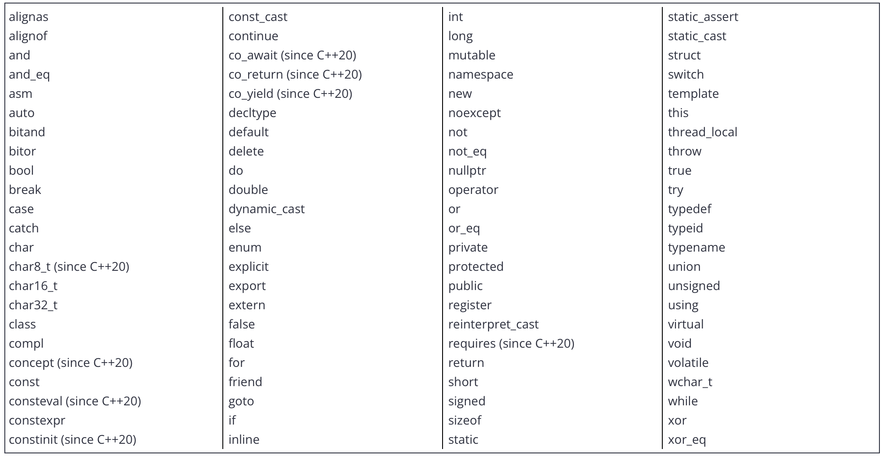

# ch1 - c++ basics

### 1.1 - statements and the structure of the program
- - -
- a statement is a type of instruction that causes the program to _perform_ some action
- there are many different kinds of statements in c++:
    1. declaration statements
    2. jump statements
    3. expression statements
    4. compound statements
    5. selection statements (conditionals)
    6. iteration statements (loops)
    7. try blocks
- a function is a collection of statements that get executed sequentially (in order, from top to bottom)
- every c++ program must have a special function named `main` (all lower case letters). programs typically terminate (finish running) after the last statement inside function `main` has been executed (though programs may abort early in some circumstances, or do some cleanup afterwards)
- functions are typically written to do a specific job or perform some useful action
- in programming, the name of a function (or object, type, template, etc...) is called **identifier**
- a **character** is a written symbol or mark, such as a letter, digit, punctuation mark, or mathematical symbol. and a sequence of characters is called **text** (also called a **string** in programming contexts)
- the set of rules that describe how specific words (and punctuation) can be arranged to form valid sentences in a language is called **syntax**

### 1.2 - comments
- - -
- a **comment** is a programmer-readable note that is inserted directly into the source code of the program. comments are ignored by the compiler and are for the programmer’s use only
- the `//` symbol begins a C++ single-line comment, which tells the compiler to ignore everything from the `//` symbol to the end of the line
- the `/*` and `*/` pair of symbols denotes a c-style multi-line comment. everything in between the symbols is ignored
- comments should be written in a way that makes sense to someone who has no idea what the code does
- converting one or more lines of code into a comment is called **commenting out** your code. this provides a convenient way to (temporarily) exclude parts of your code from being included in your compiled program

### 1.3 - introduction to objects and variables
- - -
- a single piece of data is called a **value** (sometimes called a data value)
- values placed in single-quotes are interpreted by the compiler as character values
- values placed in double-quotes are interpreted by the compiler as text values
- numeric values are not quoted
- values that are placed directly into the source code are called **literals**
- an **object** represents a region of storage (typically RAM or a CPU register) that can hold a value
- an object with a name is called a **variable**
- in general programming, the term __object__ typically refers to an unnamed object in memory, a variable, or a function. in c++, the term __object__ has a narrower definition that excludes functions
- a definition statement can be used to tell the compiler that we want to use a variable in our program
- the process of reserving storage for an object’s use is called **allocation**
- a **data type** (more commonly just called a **type**) determines what kind of value (e.g. a number, a letter, text, etc…) the object will store

### 1.4 - variable assignment and initialization
- - -
- after a variable has been defined, you can give it a value (in a separate statement) using the `=` operator. this process is called **assignment**, and the `=` operator is called the **assignment operator**
- assignment copies the value on the right-hand side of the `=` operator to the variable on the left-hand side of the operator. this is called copy-assignment
- assignment (`=`) is used to assign a value to a variable. equality (`==`) is used to test whether two operands are equal in value
- the process of specifying an initial value for an object is called **initialization**, and the syntax used to initialize an object is called an **initializer**
- there are 5 common forms of initialization in c++:
    1. default-initialization (no initializer) - `int a;`
    2. copy-initialization (initial value after equals sign) - `int b = 5;`
    3. direct-initialization (initial value in parenthesis) - `int c ( 6 );`
    4. direct-list-initialization (initial value in braces) - `int d { 7 };`
    5. value-initialization (empty braces) - `int e {};`
- when no initializer is provided, this is called **default-initialization**. in many cases, default-initialization performs no initialization, and leaves the variable with an indeterminate value (a value that is not predictable, sometimes called a “garbage value”)
- when an initial value is provided after an equals sign, this is called **copy-initialization**
- copy-initialization is also used whenever values are implicitly copied, such as when passing arguments to a function by value, returning from a function by value, or catching exceptions by value
- when an initial value is provided inside parenthesis, this is called **direct-initialization**
- the modern way to initialize objects in c++ is to use a form of initialization that makes use of curly braces. this is called **list-initialization** (or **uniform initialization** or **brace initialization**)
- list-initialization also provides a way to initialize objects with a list of values rather than a single value (which is why it is called “list-initialization”
- one of the primary benefits of list-initialization for new C++ programmers is that “narrowing conversions” are disallowed. this means that if you try to list-initialize a variable using a value that the variable can not safely hold, the compiler is required to produce a diagnostic (compilation error or warning) to notify you
- when a variable is initialized using an empty set of braces, a special form of list-initialization called **value-initialization** takes place. in most cases, value-initialization will implicitly initialize the variable to zero (or whatever value is closest to zero for a given type). iIn cases where zeroing occurs, this is called **zero-initialization**
- the term **instantiation** means a variable has been created (allocated) and initialized (this includes default initialization). an instantiated object is sometimes called an **instance**
- modern compilers will throw a warning (or an error, if the user has enabled "treat warnings and errors") if a variable is initialized but not used anywhere in the program. but there's `[[maybe_unused]]` attribute, which allows us to tell the compiler that we’re okay with a variable being unused. The compiler will not generate unused variable warnings for such variables. and additionally, the compiler will likely optimize these variables out of the program, so they have no performance impact

### 1.5 - introduction to iostream: cout, cin, and endl
- - -
- the **input/output library** (io library) is part of the c++ standard library that deals with basic input and output
- the _io_ part of _iostream_ stands for _input/output_
- to use the functionality defined within the _iostream_ library, we need to include the _iostream_ header at the top of any code file that uses the content defined in _iostream_
- the _iostream_ library contains a few predefined variables for us to use. one of the most useful is **std::cout**, which allows us to send data to the console to be printed as text. **cout** stands for “character output”
- we use the **insertion operator** (`<<`), to send the any text to he console to be printed
- to print more than one thing on the same line, the insertion operator (`<<`) can be used multiple times in a single statement to concatenate (link together) multiple pieces of output
- a **newline** is an OS-specific character or sequence of characters that moves the cursor to the start of the next line
- one way to output a newline is to output **std::endl** (which stands for “end line”)
- to output a newline without flushing the output buffer, we use `\n` (inside either single or double quotes), which is a special symbol that the compiler interprets as a newline character. `\n` moves the cursor to the next line of the console without causing a flush, so it will typically perform better. `\n` is also more concise to type and can be embedded into existing double-quoted text
- `std::cin` is another predefined variable in the `iostream` library
- `std::cin` (which stands for “character input”) reads input from keyboard

### 1.6 -  uninitialized variables and undefined behavior
- - -
- a variable that has not been given a known value (through initialization or assignment) is called an **uninitialized variable**
- initialized = the object is given a known value at the point of definition
- assignment = the object is given a known value beyond the point of definition
- uninitialized = the object has not been given a known value yet
- **undefined behavior** (often abbreviated **UB**) is the result of executing code whose behavior is not well-defined by the c++ language

### 1.7 - keywords and naming identifiers
- - -
- c++ reserves a set of 92 words (as of c++23) for its own use. these words are called **keywords** (or reserved words), and each of these keywords has a special meaning within the c++ language

- c++ also defines special identifiers: _override_, _final_, _import_, and _module_. these have a specific meaning when used in certain contexts but are not reserved otherwise
- rules to be followed while naming identifiers:
    1. the identifier can not be a keyword. Keywords are reserved
    2. the identifier can only be composed of letters (lower or upper case), numbers, and the underscore character. that means the name can not contain symbols (except the underscore) nor whitespace (spaces or tabs)
    3. the identifier must begin with a letter (lower or upper case) or an underscore. it can not start with a number
    4. c++ is case sensitive, and thus distinguishes between lower and upper case letters. `nvalue` is different than `nValue` is different than `NVALUE`

### 1.8 - whitespace and basic formatting
- - -
- **whitespace** is a term that refers to characters that are used for formatting purposes. in c++, this refers primarily to spaces, tabs, and newlines. whitespace in C++ is generally used for 3 things: separating certain language elements, inside text, and for formatting code

### 1.9 - introduction to literals and operators
- - -
- a **literal** (also known as a **literal constant**) is a fixed value that has been inserted directly into the source code
- the main difference between a literal and a variable is that a literal’s value is placed directly in the executable, and the executable itself can’t be changed after it is created. a variable’s value is placed in memory, and the value of memory can be changed while the executable is running
- in mathematics, an **operation** is a process involving zero or more input values (called **operands**) that produces a new value (called an _output value_). the specific operation to be performed is denoted by a symbol called an **operator**
- the number of operands that an operator takes as input is called the operator’s **arity**
- **unary** operators act on one operand. an example of a unary operator is the `-` operator. for example, given `-5`, `operator-` takes literal operand `5` and flips its sign to produce new output value `-5`
- **binary** operators act on two operands (often called _left_ and _right_, as the left operand appears on the left side of the operator, and the right operand appears on the right side of the operator). an example of a binary operator is the `+` operator. for example, given `3 + 4`, `operator+` takes the left operand `3` and the right operand `4` and applies mathematical addition to produce new output value `7`. the insertion (`<<`) and extraction (`>>`) operators are binary operators, taking `std::cout` or `std::cin` on the left side, and the value to output or variable to input to on the right side
- **ternary** operators act on three operands. there is only one of these in c++ (the conditional operator)
- **nullary** operators act on zero operands. there is also only one of these in c++ (the throw operator)
- there are a few operators that do not produce return values (such as `delete` and `throw`)
- an operator (or function) that has some observable effect beyond producing a return value is said to have a **side effect**

### 1.10 - introduction to expressions
- - -
- an **expression** is a non-empty sequence of literals, variables, operators, and function calls that calculates a value. the process of executing an expression is called **evaluation**, and the resulting value produced is called the **result** of the expression (also sometimes called the **return value**)
- expressions cannot be executed by themselves -- they must exist as part of a statement
- an **expression statement** is a statement that consists of an expression followed by a semicolon. when the expression statement is executed, the expression will be evaluated
- a **subexpression** is an expression used as an operand. for example, the subexpressions of `x = 4 + 5` are `x` and `4 + 5`. the subexpressions of `4 + 5` are `4` and `5`
- a **full expression** is an expression that is not a subexpression. all three expressions above (`2`, `2 + 3`, and `x = 4 + 5`) are full expressions