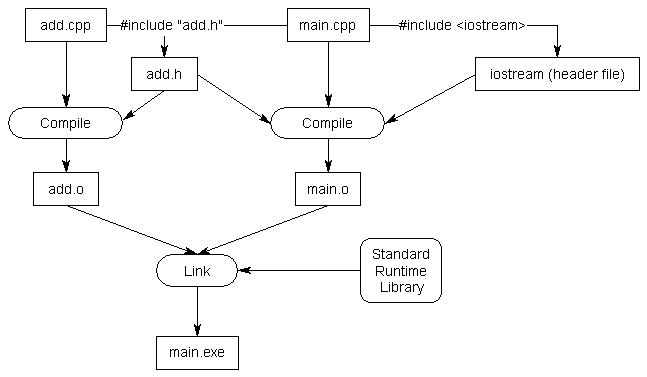

# ch2 - functions and files

### 2.1 - Intro to functions
- function = reusable block of code for a specific task
- why: splits large programs into manageable, testable, reusable chunks
- pre-defined (std lib, e.g. std::cout) vs user-defined (written by you)
- function call = triggers cpu to jump and execute that function's code instead
- caller = calls, callee = gets called; call = "invocation"
- header = declares function exists (signature); body = what it actually does
- no nested function *definitions* — but you CAN call other functions from inside one
- metasyntactic vars = placeholder names (foo, bar, baz, etc.) — just naming convention, not a rule

### 2.2 - return values
- to return a value, need 2 things:
    1. return type in the function header (e.g. int, void)
    2. return statement in the body: `return <expr>;`
- void = function returns nothing
- return type determines what kind of value the caller receives back
- return expression produces the value to be returned, return value is a copy of that value
- 2 special requirements for main():
  1. main() is required to return an int
  2. explicit function calls to main() are disallowed (cpp forbids main() from being called, only the os is allowed to call it once at the start of execution)
- cpp standard defines only 3 status codes - 0, EXIT_SUCCESS and EXIT_FAILURE (0 and EXIT_SUCCESS mean the program executed successfully, EXIT_FAILURE means the program has an error (no shit sherlock))
- a value-returning function that does not return a value will produce undefined behavior (with main() being an exception as it always implicitly returns 0 even without a return statement)
- functions can only return a single value

### 2.3 - void functions
- functions are sometimes *not* required to return a value, which is where the void return type is used
- void functions don't need a return statement
- void functions can't be used in expressions that require a value
- returning a value from a function with void return type = compile error

### 2.4 - introduction to function parameters and arguments
- a **function parameter** is a variable used in the header of a function
- function parameters work almost identically to variables defined *inside* the function, the difference being they are initialized with a value provided by the caller
- an **argument** is the value of the variable being passed from the caller when the function is being called
- when a function is called, all the parameters in it are created as variables and value of each argument is copied into the matching parameter slop using copy initialization, this is called pass by value
- the function parameters which utilize pass by value are called value parameters
- return values can be used as arguments
- if a parameter is defined in the header of a function, but not used in the body then it becomes an unreferenced parameter
- the name of a function definition is optional, so in some cases where a parameter needs to exist but is not used in the body of the function, you can simply omit the name of the parameter, this is called an unnamed parameter

### 2.5 - introduction to local scope
- variables defined inside the body of a function are called local variables
- function parameters are generally considered to be local variables
- variable lifetime is a runtime property
- cpp specification gives compilers a lot of flexibility to determine when local variables are created and destroyed, objects may be created earlier or destroyed later than anticipated for optimization purposes
- generally, local variables are created when the function is entered and destroyed when the function is exited
- the **scope** of an identifier determines where the identifier can be seen and used within the source code
- when an identifier can be seen and used, it is in scope
- when an identifier cannot be seen and cannot be used, it is out of scope
- a local variable's lifetime ends at the point where it goes out of scope (not all types of variables are destroyed when they go out of scope)
- if a function with parameters x and y were to be called twice, then the parameters x and y would be created and destroyed twice, once for each call
- a temporary object is an unnamed object that is used to hold a value that is only needed for a short period of time
- temporary objects have no scope at all, they are destroyed immediately after use

### 2.6 - why functions are useful and how to use them effectively
- benefits of functions:
    1. organization
    2. reusability
    3. testing
    4. extensibility
    5. abstraction
- refer to guidelines in 2.6 to understand where and how to use them effectively

### 2.7 - forward declarations and definitions
- when the compiler doesn't know what your function is (due to an ordering issue let's suppose), there are two common ways to address this:
    1. reorder the function definitions
    2. use a forward declaration
- to write a forward declaration, we use function declaration ending with a semicolon
- you do not need to specify the names of your parameters in function declaration but, it is recommended for better readability
- a declaration is used to tell the compiler about the existence of an object
- a definition is a declaration that actually implements of instantiates the identifier
- all definitions are declarations but not all declarations are definitions
- function declaration statement is also known as a function prototype

### 2.8 - programs with multiple code files
- needs forward declaration to access the function in another file
- used to make large projects and code easier to maintain and use
- useful in object-oriented programming

### 2.9 - naming collisions and namespaces
- if two identical identifiers are introduced in the same program, the linker can't tell them apart and this error is referred to as a naming collision
- a namespace provides a type of scope region that allows you to declare or define names inside of it 
- a namespace may only contain declarations and definitions, executable statements are not allowed unless they are part of the definition
- in cpp, any name that is not defined inside a class, function or a namespace is considered to be part of an implicitly defined namespace known as the **global namespace**
- :: is an operator, known as the scope resolution operator
- in cpp, the {} curly braces are strictly used to define a scope (also used for initialization)
- if in main(), a variable x is defined inside {}, with indentation, if you tried accessing it outside the braces, it would throw a compile error because it doesn't exist

### 2.10 - introduction to the preprocessor
- everytime you compile a .cpp file, it goes through a phase known as the preprocessing phase
- preprocessor does not modify the original code files, all the changes made by it happen temporarily in the memory
- one important role of the preprocessor - it is what processes the #include directives
- when you #include a file, the preprocessor replaces the #include directive with the contents of the included file
- conditional compilation allows you to specify under what conditions something will or will not compile
- some common directives include - #ifdef, #ifndef and #endif
- you can also use #if 0 and #if 1 to exclude blocks of code until defined points or turn them back on whenever necessary

### 2.11 - header files
- usually have a .h extension or .hpp or no extension
- header files allow us to put declarations in one place and then import them wherever we need them
- when we include a header file, we're essentially asking the preprocessor to copy all the content (including forward declarations) from the said file into the current one
- source files should include their paired header

### 2.12 - header guards
- header guard is also known as an include guard
- header guards are conditional compilation directives that take the form - #ifndef -> #define -> declaration -> endif 
- usually if two header files end up having the same guard name, the compiler might throw an error when both of the directives are called by the preprocessor
- so it is recommended to have complex and unique names for your header guards
- never put function definitions in a header, only the function declaration
- `#pragma once` is a preprocessor directive which is a simpler alternative to header guards
- `#pragma once` usually works in most cases, but it will fail in one case - if a header file is copied so that it exists in multiple places on the file system
- if both copies of the header get included, header guards will successfully remove the identical headers but, `#pragma once` won't because the compiler won't realise that they're identical content
- tldr; header guards are designed to ensure that the contents of a given header file are not copied more than once into any single file, in order to prevent duplicate definitions

### 2.13 - designing your first programs
- design step 1: define your goal
- design step 2: define requirements
- design step 3: define your tools, targets and backup plan
- design step 4: break hard problems down into easy problems
- design step 5: figure out the sequence of events

- implementation step 1: outline main() function
- implementation step 2: implement each function
- implementation step 3: final testing