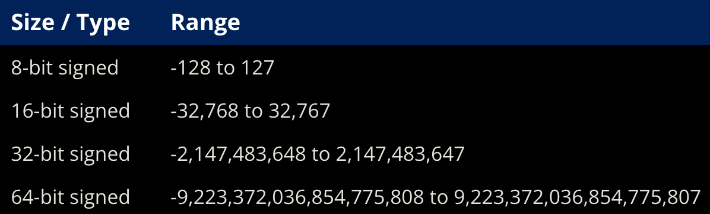
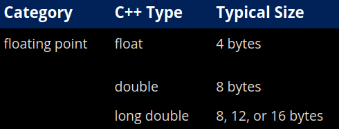
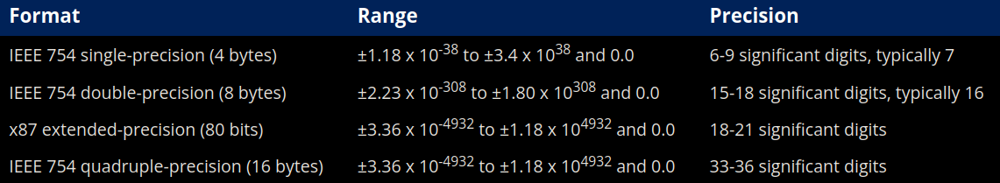
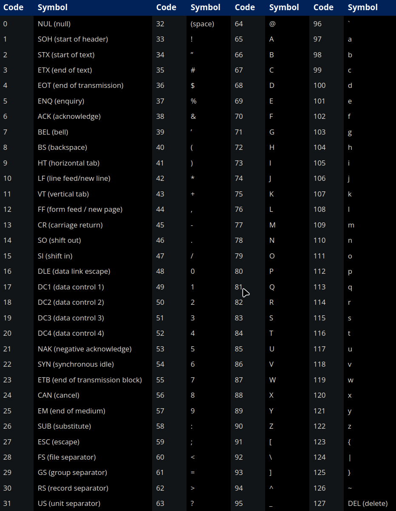
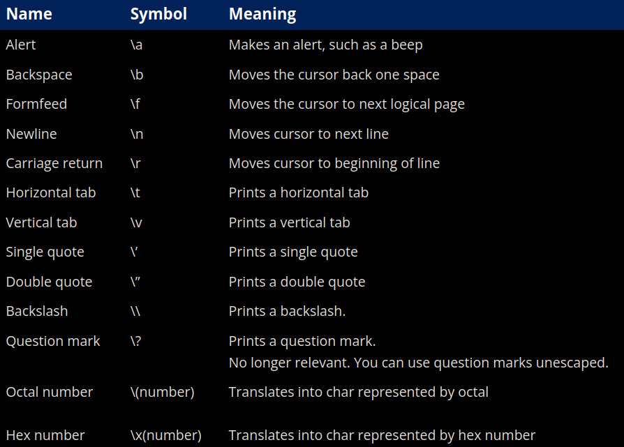

# ch4 - fundamental data types

### 4.1 - introduction to fundamental data types
- the smallest unit of memory is a bit (binary digit, 0 or 1)
- memory is organized into sequential units known as **memory addresses**
- each memory address holds 1 byte of data (1 byte = 8 bits)
- a **data type** is used to tell the compiler how to interpret the contents of memory in some meaningful way 
- the list of fundamental data types include:
    1. **float** - category: floating point value, it represents a number with a fractional part
    2. **bool** - category: integral, it represents true or false
    3. **char** - category: integral, it represents a single character of text
    4. **int** - category: integral, it represents all whole numbers, negative to positive (including 0)
    5. **nullptr** - category: null pointer, it represents a null pointer 
    6. **void** - category: void, it represents nothing at all
- the standard integer types are **short, int, long, long long**

### 4.2 - void
- **void** is an example of an incomplete type (no type)
- an **incomplete type** is a type that has been declared but not defined
- incomplete types cannot be instantiated
- most commonly, void is used to indicate that a function does not return a value

### 4.3 - object sizes and sizeof operator
- even though cpp does not have a definitive size for any of the fundamental data types, we can assume the following:

- the **sizeof** operator is a unary operator that takes a type or a variable and returns the size of that object in bytes
- sizeof does not include dynamically allocated memory used by an object

### 4.4 - signed integers
- the attribute of being positive, negative or zero is called the number's sign
- by default, integers in cpp are signed, which means the number's sign is stored as part of the value
- since the integer data type is signed by default, when you are defining signed integers it is preferred to declare them without the int suffix (ex: short, long, long long (instead of short int, long int, long long int))
- the range of a data type is said to be the set of specific values it can hold
- the following is a list of the ranges of various signed integers:

- an n-bit signed variable has a range of **-(2^(n-1)) to (2^n-1)-1**, where n is the number of bits
- if an operation attempts to create a value that is greater than the range of said data type, it will cause undefined behavior, called **integer overflow**
- when doing division with two integer values in cpp, the result will always be an integer (even if mathematically, it holds a fractional value) as the fractional part of the result is completely dropped (not rounded)

### 4.5 - unsigned integers
- unsigned integers are the integers which can only hold non-negative whole numbers
- the following is a table with the ranges of various unsigned integer data types:

- an n-bit unsigned integer has a mathematical range of 0 to (2^(n-1))-1
- when no negative numbers are required, unsigned integers might be useful for devices with less memory as they can hold more distinct values while consuming the same memory
- when an unsigned integer assumes a value greater than its range, then the value assumed is divided by the maximum value possible incremented by one, of said unsigned integer, and only the remainder is stored (example: if you give the value 280 to an 8-bit unsigned integer, it would store 24 (280/256 leaves the remainder 24))
- when an unsigned integer assumes a negative value, the value stored is the difference of the maximum value and the magnitude of the negative value
- refer to ch 4.5 on lcpp to read more about the undefined behavior with unsigned integers

### 4.6 - fixed-width integers and size_t
- the integers whose size is fixed, are known as fixed-width integers
- they are defined in the `<cstdint>` header, as follows:

- the 8-bit fixed width integer types are often treated like chars instead of integer values
- there are two other alternative sets of integers that exist - fast and least:
  1. **fast integer type** - they provide the fastest signed/unsigned integer type with a width of at least # bits (# = 8/16/32/64), *example:* `std::uint_fast32_t` gives you the fastest unsigned integer type which is at least 32 bits
  2. **least  integer type** - they provide the smallest signed/unsigned integer type with a width of at least # bits (# - 8/16/32/64), *example:* `std::uint_least32_t` gives you the smallest unsigned integer type that is at least 32-bits
- `std::size_t` is an alias for an implementation-defined unsigned integral type, it is used to represent the size or length of objects (return value)
- `std::size_t` is a typedef

### 4.7 - introduction to scientific notation
- numbers in the scientific notation take the form of: **significand * 10^exponent**
- the letter **e** is used to represent "times 10 to the power of", example: 1.2 * 10^4 can be written as 1.2e4
- the digits in the significand are known as significant digits, the more significant digits in a number, the more precise it is

### 4.8 - floating point numbers
- a floating point type variable is a number that can hold a fractional part
- floating point data types are always signed, there is no unsigned version
- there are three types of floating point data types in cpp: a single precision `float`, a double precision `double` and an extended precision `long double`
- the sizes of these are as follows:

- an f-suffix is used to denote a literal of type float, floating point literals default to the double type, example: `double b{5.0}` is a double by default but `float b{5.0f}` requires the suffix f after the value to assume a float type
- by default, std::cout will not print the fractional part if the fractional part is 0
- the range for floating point type is:

- the **precision** of a floating point type shows how many significant digits it can represent without losing information
- `std::cout` has a default precision of 6
- you can override the default precision of `std::cout` using `std:setprecision()` from the `<iomanip>` header, example: `std::cout << std::setprecision(14);`
- **output manipulators** alter how data is output and they are defined in the `<iomanip>` header
- when precision is lost because a number can't be stored precisely, it is called a **rounding error**
- there are some special values like `NaN` and `inf`, NaN means not a number and inf is infinity, there can also be signed zeroes (positive or negative)

### 4.9 - boolean values
- boolean data types are used to deal with conditions that have a definitive yes or no answer
- they can assume only two possible values: `true` or `false`
- to declare a boolean variable you need to use the keyword `bool`
- initialising a boolean variable with an empty value makes it assume `false` by default
- you can use the logical not operator (`!`) to flip the value of a boolean variable, example: `!false = true` and `!true = false`
- boolean values are not actually stored as the keywords `true` or `false`, they are stored as the integers 1 and 0 where `true = 1` and `false = 0`, this is because they are considered to be an integral type
- you can use `std::boolalpha` to make it print the keywords `true/false` instead of 0 or 1 which is the default, similarly, you can use `std::noboolalpha` to turn it off
- when you initialise or assign a value to a boolean variable using copy initialisation/assignment (`=` operator), any non zero value assigned to the variable assumes `true` and 0 assumes `false`, example: `bool b1 = 3 // true`, `bool b2 = -1 // true` and `bool b3 = 0 // false`
- inputting boolean values as `true/false` is not allows unless you use `std::boolalpha`, after which numeric values are not allowed (`0/1`)

### 4.10 - introduction to if statements
- an if statement allows us to execute one or more lines of code only if said condition is `true`
- a **condition** is an expression that evaluates to a boolean value
- `else` is used to define what the code is supposed to do when the true condition isn't met and it is skipped
- when you want to check if several things are true or false in a sequence, you can chain if statements using `else if`
- when your condition is an expression that does not evaluate to a boolean value, the result of that expression is converted to a boolean value, i.e non-zero values get converted to `true` and zero-values get converted to `false`
- a return statement that is not the last statement in a function is called an **early return**, this is not useful in unconditional functions, but when combined with if-statements, early return is very useful

### 4.11 - chars
- the `char` data type is an integral one, meaning the actual value stored underneath is actually an integer
- the integer stored by char is represented as an ASCII character
- here is the table of ASCII characters:

- codes 0-31 and 127 are known as the unprintable chars, they were designed to control peripheral devices such as printers
- codes 32-126 are known as the printable characters, they represent letters, numbers and punctuation
- you can initialise char variables using the character literals (example: `'a'`) or using the integer corresponding to their ASCII value (example: `97`)
- during extraction, leading whitespaces are skipped so if you want to extract a whitespace from `std::cin`, you need to use `std::cin.get()` instead as it does not ignore the whitespaces
- there are some sequences of characters with a special meaning and use, they are called **escape sequence**
- here is a table of all the escape sequences:

- avoid using double quotes (`"`) to output character literals, as this leads to a lot of undefined behaviour

### 4.12 - type conversion and static_cast
- the process of converting data from one type to another type is called **type conversion**
- when the compiler does type conversion without explicitly asking us, it is called **implicit type conversion**
- temporary objects are usually used in type conversion as the value remains unchanged for the original variable
- when the programmer explicitly tells the compiler to convert a value from one type to another, it is called **explicit type conversion**
- to perform an explicit type conversion we need to use the `static_cast` operator (syntax: `static_cast<new_type>(expression)`)
- you can use `static_cast` for sign conversions, i.e signed integral values can be converted to unsigned and vice-versa