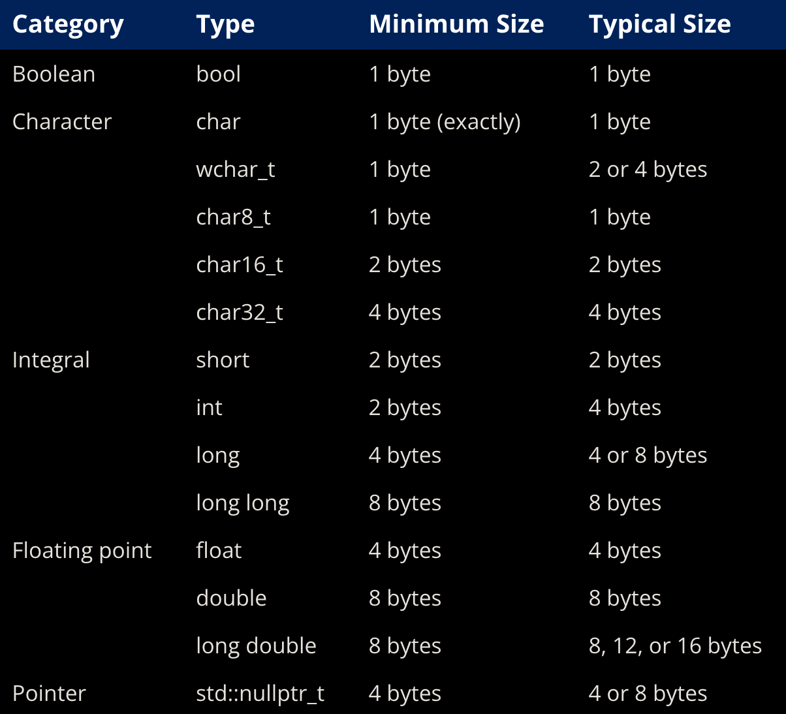

# ch4 - fundamental data types

### 4.1 - introduction to fundamental data types
- the smallest unit of memory is a bit (binary digit, 0 or 1)
- memory is organized into sequential units known as **memory addresses**
- each memory address holds 1 byte of data (1 byte = 8 bits)
- a **data type** is used to tell the compiler how to interpret the contents of memory in some meaningful way 
- the list of fundamental data types include:
    1. **float** - category: floating point value, it represents a number with a fractional part
    2. **bool** - category: integral, it represents true or false
    3. **char** - category: integral, it represents a single character of text
    4. **int** - category: integral, it represents all whole numbers, negative to positive (including 0)
    5. **nullptr** - category: null pointer, it represents a null pointer 
    6. **void** - category: void, it represents nothing at all
- the standard integer types are **short, int, long, long long**

### 4.2 - void
- **void** is an example of an incomplete type (no type)
- an **incomplete type** is a type that has been declared but not defined
- incomplete types cannot be instantiated
- most commonly, void is used to indicate that a function does not return a value

### 4.3 - object sizes and sizeof operator
- even though cpp does not have a definitive size for any of the fundamental data types, we can assume the following:

- the **sizeof** operator is a unary operator that takes a type or a variable and returns the size of that object in bytes
- sizeof does not include dynamically allocated memory used by an object

### 4.4 - signed integers
- the attribute of being positive, negative or zero is called the number's sign
- by default, integers in cpp are signed, which means the number's sign is stored as part of the value
- since the integer data type is signed by default, when you are defining signed integers it is preferred to declare them without the int suffix (ex: short, long, long long (instead of short int, long int, long long int))
- the range of a data type is said to be the set of specific values it can hold
- the following is a list of the ranges of various signed integers:

- an n-bit signed variable has a range of **-(2^(n-1)) to (2^n-1)-1**, where n is the number of bits
- if an operation attempts to create a value that is greater than the range of said data type, it will cause undefined behavior, called **integer overflow**
- when doing division with two integer values in cpp, the result will always be an integer (even if mathematically, it holds a fractional value) as the fractional part of the result is completely dropped (not rounded)