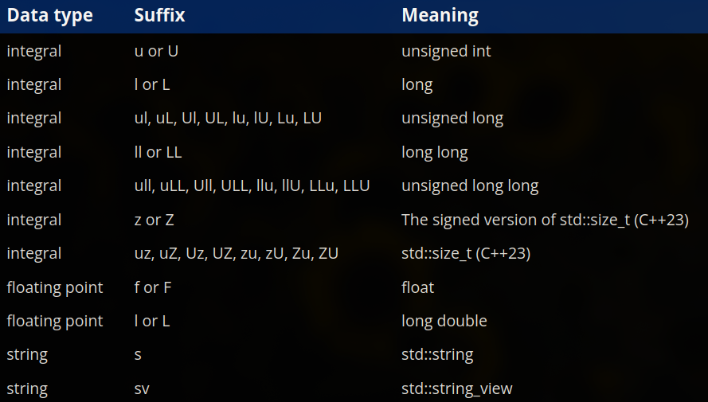

# ch5 - constants and strings

### 5.1 - constant variables
- - -
- a **constant** is a value that may not be changed during the program's execution
- there are two types of constants:
    1. **named constants** - these are the constant values with an identifier, also called *symbolic constants*
    2. **literal constants** - these are the constant values that do not have an identifier
- a variable whose value cannot be changed after initialization is called a **constant variable**
- you can declare a constant variable using the `const` keyword
- a **type qualifier** is a keyword that is applied to a said type and it changes the behavior of said type

### 5.2 - literals
- - -
- **literals** are values that are directly inserted into the code
- they are sometimes called **literal constants** as their value cannot be redefined
- when the default type of a literal is not what you desire, you can change that type using a suffix
- here is a table of available suffixes for the type conversion of literals:

- most suffixes are not case sensitive, the exceptions being `s` and `sv` must always be lowercase, two consecutive 'L' characters must have the same casing (example: `LL` or `ll` is allowed but not `Ll` or `lL`)
- by default the floating point literals have a type of `double`, to make them float literals, the `f` suffix is needed
- a **magic number** is a hard-coded literal embedded directly into the source code without any context or explanation, this should usually be avoided 

### 5.3 - numeral systems
- - -
- by default, numbers in c++ programs are assumed to be decimal
- decimal is called base 10 because there are 10 possible digits (0-9)
- binary is called base 2 because there are 2 possible digits (0 or 1)
- octal is called base 8 because there are 8 possible digits (0-7)
- to use an **octal literal**, just prefix your literal with a `0` (example: 012 = 10)
- hexadecimal is called base 16 because there are 16 possible digits (0-9 and A-F)
- to use a **hexadecimal literal**, you need to prefix your literal with `0x`, (example: 0xF = 15)
- we can say that one hexadecimal digit encompasses 4 bits, a pair of hexadecimal digits can be used to represent a full byte
- to use a **binary literal**, use the prefix `0b` (example: 0b1 = 0000 0000 0000 0001)
- since some literals are hard to read because they are too long, you can use the digit seperator `'` to make your code more readable, note that a digit seperator cannot be used before the first digit of any value
- you can change the way cpp outputs your value using the i/o manipulators - `std::hex`, `std::oct`, `std::dec`, etc
- to output a binary literal, you need to use `std::bitset`, from `<bitset>` header
- you can also use the `<format>` library to output binary, in newer versions of cpp

### 5.4 - the as-if rule and compile-time optimization
- - -
- optimization is the process of modifying said software to make it work more efficiently
- a program called the **profiler** can be used to see how long each part of the program is taking to run, and what impacts the overall performance
- a program that optimizes another program is called an **optimizer**
- low-level optimizations usually only yield small performance gains, but their cumulative effect results in a significant performance improvement
- the **as-if** rule states that the compiler can modify a program however it likes in order to produce more optimized code, as long as those modifications do not affect a program's "observable behaviour"
- modern cpp compilers are capable of fully or partially evaluating certain expressions at compile time (instead of runtime), when the compiler does this it is called **compile-time evaluation**
- some common optimization techniques include:
  1. **constant folding** - it is a technique where the compiler replaces expressions having literals as its operands with the result of said expression, this results in the program outputting the same value, but no calculation is needed anymore at runtime after the first time, improving performance and reducing cpu cycles
  2. **constant propagation** - it is a technique where the compiler replaces variables having a constant value throughout the program with a literal of that value, for example if a variable x has a constant value of 7 throughout the program, the compiler replaces all instances of x with the literal value 7, removing the need to store and fetch the value from the variable, increasing performance
  3. **dead code elimination** - it is a technique where the compiler removes code that may be executed but has no effect on the program's behaviour
- when a variable is removed from a program because it is no longer needed, we say it has been **optimized out/away**
- optimization makes debugging hard, so debug builds usually leave it turned off, for example when you try to debug a code at runtime that has been optimized and try to watch a variable that has been optimized out, you will not be able to locate the variable and if you try to step into a function that has been optimized away, the debugger will simply skip over it, making it significantly harder to debug
- a **compile-time constant** is a constant whose value is known at compile time (example: literals)
- a **runtime constant** is a constant whose value is determined at runtime (example: constant function parameters - `int example(const int x)`)

### 5.5 - constant expressions
- - -
- the cpp language provides us with ways for us to be explicit about what parts of the code we want to execute at compile-time, using these features that result in a compile-time evaluation is known as **compile-time programming**
- refer to the benefits of compile time programming from ch 5.5
- a **constant expresssion** is a non-empty sequence of literals, constant variables, operators and function calls all of which must be evaluatable at compile-time (each and every part of the expression needs to be evaluatable at compile-time for it to work)
- an expression that is not a constant expression is usually referred to as **runtime expression**
- constant expressions are capable of being evaluated at compile-time, but they will not always be evaluated at compile-time, the compiler is only required to evaluate a constant expression at compile-time only in a context that requires a constant expression, in contexts that do not require a constant expression, it is up to the compiler to decide whether it is going to evaluate it at compile-time or runtime
- refer to ch 5.5 to read more about the likelihood of an expression being evaluated at compile time and why all constant expressions do not get evaluated at compile-time

### 5.6 - constexpr variables
- - -
- we can use the `constexpr` keyword to declare a compile-time constant, a **constexpr** variable is *always* a compile-time constant, it must be initialized with a constant expression 
- constexpr works with variables with non-integral types
- any constant variable whose initializer is a constant expression should be declared as `constexpr`, any constant variable whose initializer is not a constant expression (a runtime constant), should be declared as `const`
- read the advanced reader block in ch 5.6 about arrays, pretty cool fact 

### 5.7 - introduction to std::string
- - -
- c-style string literals are fine to use, but when declared as a variable they behave oddly and are hard to work with 
- to work with string variables, we have `std::string` and `std::string_view`, which are not fundamental types but class types
- you need to include the `<string>` header to work with the class types mentioned above
- `std::string` can store strings of different lengths, this is one of its neatest features
- strings in cpp are made up of the explicit characters and the null terminator at the end 
- if `std::string` does not have enough memory to store a string, it will request additional memory at runtime using a form of memory allocation known as dynamic allocation
- when using `std::cin` with a `std::string`, the whitespaces break the input, so if you have multiple words to input, it won't work if you use `std::cin`
- to fix this issue, we have `std::getline` which is used with `std::cin`and `std::ws` to take input for string variables
- `std::ws` is an input manipulator which tells `std::cin` to ignore any leading whitespaces before extraction
- you can use the `.length()` function along with `std::cout` to check the length of a string
- `.length()` is a special type of function that is nested within the std::string, and it is called a member function and can only be used on string variables that are declared using the string library with `std::string`
- note: with normal standalone functions we call `function(object)` but with member functions we call `object.function()`
- `std::string::length()` returns an unsigned integral value, to assign the length to an int variable you should use `static_cast` to avoid compiler warnings and to keep your data consistent, example: `int length {static_cast<int>(name.length())};`
- you can also use `std::ssize()` function to get the length of a `std::string` as a large signed integral type
- initializing a `std::string` is expensive, so you should try to avoid using it in loops and minimize the amount of copies made for optimization purposes
- do not pass `std::string` by value, since it is already expensive to maintain and you cannot afford to make a seperate copy of said string just for a trivial function, you should instead pass by reference instead 
- avoid returning `std::string` by value as doing so makes an expensive copy, unless its for the following:
  1. a local variable of type `std::string`
  2. a `std::string` that has been returned by value from another function call or operator
  3. a `std::string` that is temporarily created as part of the return statement
- we can make `std::string` type literals using the suffix `s` after the end of every string, after the double quotes, example: `std::cout << "Archer"s;

### 5.8 - introduction to std::string_view
- - -
- unlike fundamental data types, initializing and copying a string is quite slow
- `std::string_view` exists in the `<string_view>` header
- `std::string_view` provides read-only access to an existing string without making a copy (because as we know, making a copy is inefficient for usual tasks)
- `std__string_view` is preferred over `std::string` in most cases for function parameters
- a `std::string_view` object can be initialized using a c-style string literal, a `std::string` or another `std::string_view`, making it very versatile
- c-style string literals and `std::string` objects implicitly convert to `std::string_view` if the function has that as its parameter, and this is recommended by default for all functions 
- we can create string literals with the type `std::string_view` by using an `sv` prefix after the double quotes in said string, example: `std::cout << "foo"sv`
- `std::string_view` is a type supported by constexpr