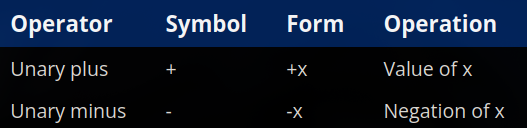
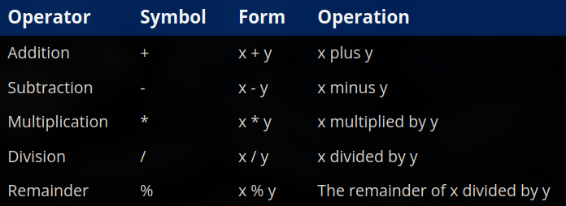
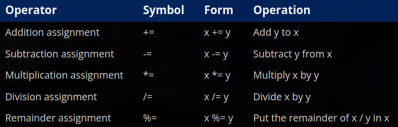
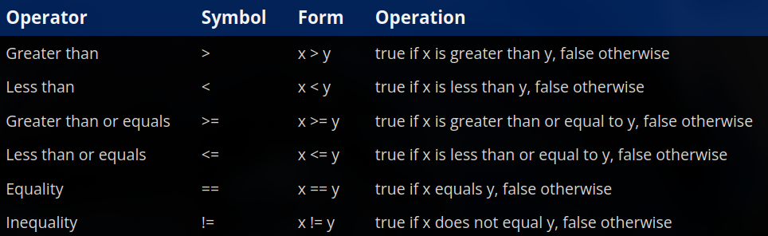
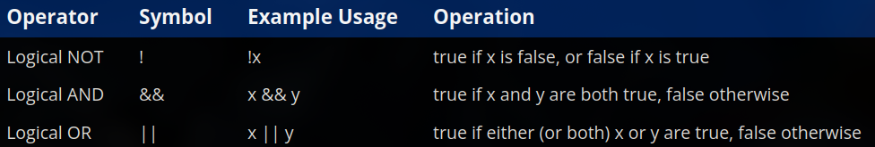
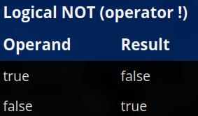
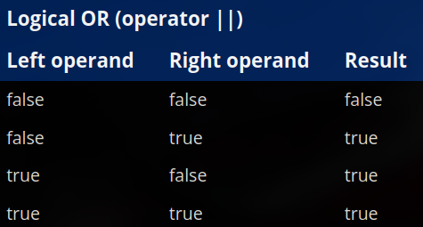
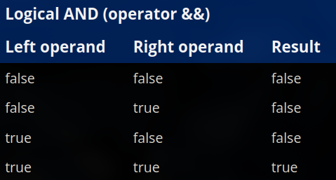
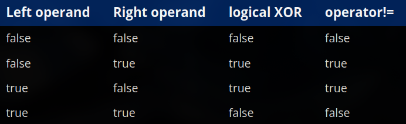

# ch6 - operators

### 6.1 - operator precedence and associativity
- - -
- an operation is a mathematical process involving zero or more operands to produce a new value, the operation to be performed is denoted by the **operator**
- to help with compound expressions, all operators are assigned a level of precedence, the ones with **higher precedence** are grouped with the operands first
- when there are two operators with the same precedence level adjacent to each other, the compiler uses the operator's **associativity** to evaluate the expression either from left to right or right to left
- below is a table containing the precedence and associativity of all operators in cpp (1 being the highest, 17 being the lowest):

| **precedence** | **associativity** | operator | description | pattern |
|---|---|---|---|---|
| 1 | L -> R | :: | global scope (unary) | ::name |
| 1 | L -> R | :: | namespace scope (binary) | class_name::member_name |
| 2 | L -> R | () | parentheses | (expression) |
| 2 | L -> R | () | function call | function_name(arguments) |
| 2 | L -> R | type() | functional cast | type(expression) |
| 2 | L -> R | type{} | list init temporary object (c++11) | type{expression} |
| 2 | L -> R | [] | array subscript | pointer[expression] |
| 2 | L -> R | . | member access from object | object.member_name |
| 2 | L -> R | -> | member access from object ptr | object_pointer->member_name |
| 2 | L -> R | ++ | post-increment | lvalue++ |
| 2 | L -> R | -- | post-decrement | lvalue-- |
| 2 | L -> R | typeid | run-time type information | typeid(type) or typeid(expression) |
| 2 | L -> R | const_cast | cast away const | const_cast<type>(expression) |
| 2 | L -> R | dynamic_cast | run-time type-checked cast | dynamic_cast<type>(expression) |
| 2 | L -> R | reinterpret_cast | cast one type to another | reinterpret_cast<type>(expression) |
| 2 | L -> R | static_cast | compile-time type-checked cast | static_cast<type>(expression) |
| 2 | L -> R | sizeof... | get parameter pack size | sizeof...(expression) |
| 2 | L -> R | noexcept | compile-time exception check | noexcept(expression) |
| 2 | L -> R | alignof | get type alignment | alignof(type) |
| 3 | R -> L | + | unary plus | +expression |
| 3 | R -> L | - | unary minus | -expression |
| 3 | R -> L | ++ | pre-increment | ++lvalue |
| 3 | R -> L | -- | pre-decrement | --lvalue |
| 3 | R -> L | ! | logical not | !expression |
| 3 | R -> L | not | logical not | not expression |
| 3 | R -> L | ~ | bitwise not | ~expression |
| 3 | R -> L | (type) | c-style cast | (new_type)expression |
| 3 | R -> L | sizeof | size in bytes | sizeof(type) or sizeof(expression) |
| 3 | R -> L | co_await | await asynchronous call | co_await expression (c++20) |
| 3 | R -> L | & | address of | &lvalue |
| 3 | R -> L | * | dereference | *expression |
| 3 | R -> L | new | dynamic memory allocation | new type |
| 3 | R -> L | new[] | dynamic array allocation | new type[expression] |
| 3 | R -> L | delete | dynamic memory deletion | delete pointer |
| 3 | R -> L | delete[] | dynamic array deletion | delete[] pointer |
| 4 | L -> R | ->* | member pointer selector | object_pointer->*pointer_to_member |
| 4 | L -> R | .* | member object selector | object.*pointer_to_member |
| 5 | L -> R | * | multiplication | expression * expression |
| 5 | L -> R | / | division | expression / expression |
| 5 | L -> R | % | remainder | expression % expression |
| 6 | L -> R | + | addition | expression + expression |
| 6 | L -> R | - | subtraction | expression - expression |
| 7 | L -> R | << | bitwise shift left / insertion | expression << expression |
| 7 | L -> R | >> | bitwise shift right / extraction | expression >> expression |
| 8 | L -> R | <=> | three-way comparison (c++20) | expression <=> expression |
| 9 | L -> R | < | comparison less than | expression < expression |
| 9 | L -> R | <= | comparison less than or equals | expression <= expression |
| 9 | L -> R | > | comparison greater than | expression > expression |
| 9 | L -> R | >= | comparison greater than or equals | expression >= expression |
| 10 | L -> R | == | equality | expression == expression |
| 10 | L -> R | != | inequality | expression != expression |
| 11 | L -> R | & | bitwise and | expression & expression |
| 12 | L -> R | ^ | bitwise xor | expression ^ expression |
| 13 | L -> R | \| | bitwise or | expression \| expression |
| 14 | L -> R | && | logical and | expression && expression |
| 14 | L -> R | and | logical and | expression and expression |
| 15 | L -> R | \|\| | logical or | expression \|\| expression |
| 15 | L -> R | or | logical or | expression or expression |
| 16 | R -> L | throw | throw expression | throw expression |
| 16 | R -> L | co_yield | yield expression (c++20) | co_yield expression |
| 16 | R -> L | ?: | conditional | expression ? expression : expression |
| 16 | R -> L | = | assignment | lvalue = expression |
| 16 | R -> L | *= | multiplication assignment | lvalue *= expression |
| 16 | R -> L | /= | division assignment | lvalue /= expression |
| 16 | R -> L | %= | remainder assignment | lvalue %= expression |
| 16 | R -> L | += | addition assignment | lvalue += expression |
| 16 | R -> L | -= | subtraction assignment | lvalue -= expression |
| 16 | R -> L | <<= | bitwise shift left assignment | lvalue <<= expression |
| 16 | R -> L | >>= | bitwise shift right assignment | lvalue >>= expression |
| 16 | R -> L | &= | bitwise and assignment | lvalue &= expression |
| 16 | R -> L | \|= | bitwise or assignment | lvalue \|= expression |
| 16 | R -> L | ^= | bitwise xor assignment | lvalue ^= expression |
| 17 | L -> R | , | comma operator | expression, expression |

- we can explicitly set the grouping of the operands using parentheses, just like in mathematics, this is called **parenthesization**
- the order of evaluation for operands is unspecified, it depends on the compiler, look at the 6.1 src file to understand it practically

### 6.2 - arithmetic operators
- - -
- **unary operators** are operators that only take one operand, there only two unary arithmetic operators: **unary plus & unary minus**, the unary minus operator returns the value of the operand multiplied by -1 and the unary plus operator returns the value of the operand (example: `x = +5` and `x = -5`), unary plus is considered redundant since the absence of it defaults to unary plus anyway

- **binary operators** are the operators that take a left and right operand, there are 5 binary arithmetic operators: addition (`+`), subtraction (`-`), multiplication (`*`), division (`/`) and remainder/modulo (`%`), they work just like their mathematical counterparts without any caveats

- the divison operator has two modes, when there are two floating point values - it returns a floating point value as the return (keeping the fractional part), but if you divide two integral values - it returns an integer value (dropping the fractional part), if you wish to perform division between two integers without losing the fractional part you need to use the `static_cast<>` operator, note that even if either operand is a floating point value, it will result in floating point division and not integral division
- integer divison with a divisor of `0` will cause undefined behaviour as the result is mathematically undefined (however, dividing it with `0.0` will result in either `NaN` or `Inf`, depending on your architecture)
- there are 5 arithmetic assignment operators: addition assignment (`+=`), subtraction assignment (`-=`), multiplication assignment (`*=`), division assignment (`/=`) and remainder assignment (`%=`), where each performs a certain operation and assignment

- an operator that can modify the value of one of its operands is called a **modifying** operator, most operators in cpp are **non-modifying**, the exceptions being assignment operators and increment/decrement

### 6.3 - remainder and exponentiation
- - -
- as we already know, in cpp the remainder operator is the `%` operator, it returns the remainder after division of the operands
- people call it modulo as well, but remainder is preferred as modulo in math means something else (example: -21 modulo 4 in math is 3, but in cpp it returns 1)
- there is no exponent operator in cpp, you need to either manually multiply the integers or put them in a loop, both of which are redundant, so we have the `<cmath>` library instead which lets us use the `pow()` function to find exponential values
- but the `pow()` function takes in floating point values as its parameters, in which the results may not be precise sometimes, for that you should just make your own function to calculate the integral exponentiation 

### 6.4 - increment/decrement operators and side effects
- - -
- **incrementing** meaning adding 1 to a variable, **decrementing** means subtracting 1 from a variable, denoted by `++` and `--` respectively
- there are two versions of each operator, a prefix and postfix version
- in the prefix version (example: `++x`), the operand is first incremented or decremented and then the expression evaluates to the value of the operand
- in the postfix version (example: `x++`), a copy of the operand is made and then the operand (not copy) is incremented or decremented 
- in simpler terms: **prefix** = increment first, use the new value, **postfix** = use the current value first, then increment
- usually in many cases, the prefix and postfix operators produce the same behavior, so in cases where the code can be written to use either prefix or postfix, prefer the **prefix** versions as they are more performant (since postfix has more steps, leading to more compute time)
- as we learnt in ch2, a function or an expression is said to have a **side effect** if it has some observable effect beyond producing a return value, common examples of this include: changing the value of objects, doing input or output etc.
- the assignment operators, prefix and postfix operators have side effects that permanently change the value of an object
- read the end of this chapter for some useful info and things to avoid as the side effects usually cause order of evaluation issues

### 6.5 - the comma operator
- - -
- the comma operator `,` allows you to evaluate multiple expressions wherever a single expression is allowed
- it evaluates the left operand first, and then the right operand and then returns the result of the right operand
- in simpler terms: the comma operators runs for both sides, but only returns the result for the right side
- it is common practice to avoid using the comma operator (except for within loops, which we will learn about later)
- the comma symbol though is often used as a seperator (example: function parameters, declaring multiple variables), doing this will not invoke the comma operator (however, declaring multiple variables using the comma seperator is highly discouraged, we will talk about this later)

### 6.6 - the conditional operator
- - -
- the conditional operator `?:` is also called the arithmetic if operator
- it is a ternary operator (it takes 3 operands), it is also cpp's only ternary operator
- the `?:` operator provides a shorthand method for executing a particular type of if-else statement
- it takes the form `condition ? expression1 : expression2`, if the condition evaluates to true then expression1 is evaluated, else expression2 is evaluated, however unlike traditional if-else, here `:` and `expression2` are not optional
- it is preferred to parenthesize the entire conditional operation, including the operands when used in a compound expression to avoid undefined behaviour
- it needs the second and third operand to be of the same type or at least convertible to the other type, or else it will throw a compile error

### 6.7 - relational operators and floating point comparisons
- - -
- **relational** operators are the operators which let you compare two values, there are 6 relational operators

- each of these operators evaluates to a boolean value true (`1`) or false (`0`)
- something to note is that comparing floating point values using the relational operators can sometimes be dangerous, as these values are not precise and have small rounding errors which can throw off the relational operators
- if you want to compare floating point values, you can compare their difference against epsilon, epsilon is the constant which represents "close enough", to learn more about it read ch 6.7 and also take a look at the src file 6-07

### 6.8 - logical operators
- - -
- logical operators provide us with the ability to test multiple conditions simultaneously, there are 3 logical operators

- logical NOT flips a boolean value from true to false and false to true

- logical OR is used to test whether either of two conditions is true, as long as one operand or both operands are true, it will return true

- logical AND is used to test whether both the operands are true, if both are true then it returns true otherwise it returns false

- if the left operand in a logical AND returns false, the logical AND immediately returns false without even checking the second operand, this is known as **short circuit evaluation** and is done for optimization purposes
- logical AND has a higher precedence than logical OR and will be evaluated ahead of logical OR unless explicitly parenthesized 
- we don't have a logical XOR in cpp, but the operator `!=` produces the same result as a logical XOR when given bool operands

- read the advanced blocks in ch 6.8 for more info about logical XOR and de morgan's law

