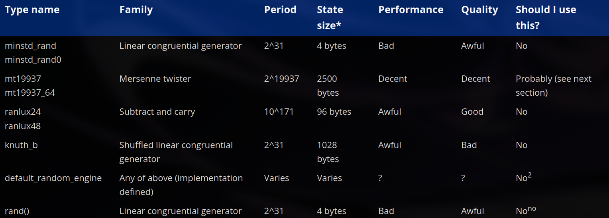

# ch8 - control flow

### 8.1 - control flow introduction 
- - -
- the *specific* sequence of statements that the CPU executes is called the program's **execution path**
- if the execution path of the program is the same in all conditions every time they are run, it is known as a **straight-line program**
- **control flow statements** are the statements which allow the programmer to change the normal path of execution through the program
- when a control flow statement causes point of execution to change to a non-sequential statement, it is called **branching**
- here are some categories of control flow statements

### 8.2 - if statements and blocks
- - - 
- a **conditional statement** is a statement that specifies whether some associated statement should be executed or not
- the two basic types of conditionals are `if` statements and `switch` statements (we will talk about `switch` later)
- note that else is optional when using an if statement 
- when you want to use multiple statements based on some condition, you use a compound statement (block)
- but for a single statement, the compiler implicitly declares a block 
- whether to put single statements in a block or not has been up for debate for a while now, although it is good practice to put it in a block for readability purposes, a reasonable middle ground is to write the single statement on the same line as the if-else statements (example: `if (age>= x) do y`)
- keep in mind that this single line method is harder to debug as it is difficult to tell whether a statement was actually executed or skipped
- use `if-else` when you want to execute the code after the first true condition, use `if-if` when you want to execute the code for all true conditions

### 8.3 - common if statement problems
- - -
- when you nest an if statement with another if statement without a block, it makes it unclear which if statement the else belongs to, this is called the **dangling else** problem
- you can flatten nested if statements by restructuring the logic or using logical operators (example: using the `&&` operator to check more than one condition at once)
- a **null statement** is a statement that just consists of a semicolon `;`, these statements do nothing, they are just used when the language requires a statement to exist but the programmer doesn't need one, it is good practice to place null statements in their own line for better readability (note that they are rarely used with if statements, most of the use cases are limited to loops)
- an example of why the null statement is placed in its own line for readability is `if (func());`, this compiles fine and is treated the same way if the semicolon was actually the condition of the if statement, but this causes a lot of confusion as to why it exists and might even mislead people to believe that the if statement ended with a semicolon
- note that if you terminate an if statement, the statements inside the if statement will execute unconditionally even when they are placed inside a block
- just like how python has the `pass` keyword to act as its null statement, cpp has a preprocessor statement that can mimic the functionality of the pass statement, it is called `PASS` and it needs to end with a semicolon so that when pass gets stripped out by the preprocessor, the trailing semicolon gets interpreted as the null statement by the compiler
- inside a condition you need to use the operator `==` to check for equality and not `=` (which is used for assignment)

### 8.4 - constexpr if statements 
- - -
- let us consider a case where the conditional is a constant expression (example: the value of `gravity: 9.8`, this is constant throughout the program, the if statement will always evaluate to true), the else statement will never be executed 
- evaluating a constexpr conditional at runtime is wasteful since the result will never vary, it is also wasteful to compile code into the executable that can never be executed
- to fix this, we have **constexpr if statements** in cpp, the conditional of a constexpr if statement is always going to be evaluated at compile time
- if the constexpr conditional evaluates to true, the entire if-else block will just be replaced by the true statement, this reduces wastage while still checking for the condition
- favour constexpr if statements over non-constexpr if statements when the conditional is a non-constant expression

### 8.5 - switch statements basics
- - -
- a **switch statement** is built for testing one expression against a set of possible values, for equality 
- it executes and evaluates the expression only once instead of repeatedly
- switch statements only work with integral values as compilers implement switch statements using **jump tables** (idk about this much yet, will learn in detail later)
- inside the switch statements, we use labels to test for the values, there are two kinds:
    1. case label - uses the `case` keyword followed by a constant expression
    2. default label - the label with the condition which runs when there is no matching value
- we use **break statements** to tell the compiler that we are done executing statements within the switch and the execution must continue after the end of the switch block
- note that inside a case statement, all the labels must be unique
- **switch vs if-else**: **switch** is better when testing one expression against a small number of exact values and only only evaluates the expression once, **if-else** is needed for comparisons other than equality

### 8.6 - switch fallthrough and scoping
- - -
- when you use a switch statement, the execution begins where the evaluated result matches a certain case label, however since it begins at a certain case label, all the other statements after it (within the switch statement) are also executed
- in other words, when execution flows from a statement underneath a label into other statements underneath the subsequent lavels it is called a **fallthrough**
- to prevent this, we use `return` or `break` control flow statements in every case label
- in cases where fallthrough is intended, you can use the attribute `[[fallthrough]]` to make it easier for other people and the compiler (since the compiler flags fallthrough as a warning) to understand that fallthrough is intended
- at this point we don't know much about attributes yet, but keep in mind that **attributes** are a modern cpp feature which allow the programmer to provide the compiler with some additional data about the codee, to specify an attribute, the name is placed between double brackets
- just like how you can combine multiple tests into a single statement using the logical operators, you can do so with the switch statements as well by placing multiple case labels in a sequence
- when you use an if statement, you need to place the statement after the if statement in a block, or the compiler will implicitly do so, but in switch statements, the case lavels are scoped as part of the switch block and not individual case labels
- you can declare/define and assign values to variables inside the case labels but you cannot intialize them
- however if you need to initalize something after a case label, you can do so by putting the case statements inside a block

### 8.7 - goto statements
- - -
- the unconditional jump is another type of control flow statement which directs the flow of execution to another point in the code, essentially "jumping" to another point in the code
- it is called an unconditional jump as it always happens when used, without any condition like if-else
- in cpp, unconditional jumps are implemented through **goto statements** and the spot to jump to is identified by the use of a statement label (just like switch case labels, these labels are conventionally not indented)
- statement labels have function scope (this is a third type of scope other than local and global), which means that the label is visible throughout the function even before its point of declaration, the only caveat is that the goto statement and the statement label must appear in the same function 
- there are two primary limitations to jumping:
  1. you can only jump within the bounds of a single function 
  2. if you're trying to jump forward, you can't jump forward over the initialization of any variable that is still in scope
- conventionally, goto statements are to be avoided because they result in spaghetti code, i.e code that has a path of execution that resembles a bowl of spaghetti (the flow of execution and logic is extremely hard to follow as it is all twisted and tangled)

### 8.8 - introduction to loops and while statements
- - -
- loops are control flow statements that are used to repeatedly execute code until a certain condition is met
- the **while** loop is a type of loop and it keeps looping as long as the condition that is defined evaluates to `true`
- note that if the condition initally evaluates to `false` then the statement associated, will not execute at all
- if a condition always evaluates to `true`, then the while loop will execute forever, this is called an **infinite loop** (the only way out is a break/return/exit/goto statement)
- you can use `while(true)` for intentional infinite loops
- if you place a semicolon at the end of the condition of the while loop, and the condition always evaluates to `true`, it treats it like a while loop whose body is a null statement (`;`), and this hangs your program as it infinitely does nothing, this is called an **unintentional infinite loop**
- although the use of semicolon after a condition is conventionally considered a mistake, sometimes you can see that people use it to repeatedly call a function until it returns `false`
- a **loop variable** is a variable that is used to control how many times a loop executes, most loop variables use the `int` data type, but occasionally you will see `char` or other types being used as well
- note that the most common names for loop variables are `i`, `j` and `k`
- there are many types of loop variables but the most common one we see is a **counter**, it counts and keeps track of how many times a loop has been executed 
- try to use signed integers for your loop variables almost all the time as unsigned ones may cause overflow and undefined behavior
- each time a loop executes, it is called an **iteration**, if you want to do something after every n iterations, you can do so using the remainder operator with the counter (most common method)
- it is possible to run a loop inside another loop, this is known as a nested loop

### 8.9 - do while statements
- - -
- a **do while** statement is a looping construct that works just like a while loop, except the statement always executes at least once, after the statement has been executed once, it checks the condition and if it evaluates to true, the loop executes again
- this is preferred over while loops to reduce complexity and increase readability 
- but again, of course do while loops aren't used and it is recommended to avoid them altogether (just like almost every other feature so far (fry))

### 8.10 - for statements
- - -
- the **for statement** is also called a for loop and it is the most utilised loop statement in cpp
- every for loop is in the form `for(init statement; condition; end-expression)`, the init statement only executes the first time and its used to either initialise or define the loop variable, after the first iteration it just loops back to the second step (condition) instead of the first, if the condition returns false, then the loop is terminated immediately, if it returns true then the third step (end-expression) is executed including a specified statement (loop body) if there is any
- avoid using `!=` when doing numeric comparisons for the loop condition using the loop variable, prefer `</> or <=/>=` instead, the reason is stated on lcpp but tldr: the loop wont terminate if somehow the loop variable jumps over the value that is checked by the `!=` operator
- **off-by-one** errors occur when the loop iterates one too many or one too few times to produce a result, we can fix this by using the proper relational operators (this is also caused due to post increment/decrement or pre increment/decrement in some cases)
- it is also possible to omit the expressions when initialising a for loop, you can initialise the loop variable somewhere else and omit it in the for loop statement, you can use the end-expression at the end of the loop body instead of the for loop statement and it would look something like this `for(;condition;)`, works the same way as a while loop
- note that if you omit the condition itself, the for loop evaluates to true, so `for(;;)` actually evaluates to `true` instead of `false` like many would expect, so it has the same behaviour as `while(true)` but it should be avoided and `white(true)` should be preferred over it
- you can declare multiple loop variables in the same for statement, and also multiple end-expressions in the same statement using the comma `,` operator
- just like other types of loops, for loops can also be nested inside other loops or just nested inside another for loop
- in a nested for loop, the outer loop runs once first, then the inner loop is executed entirely before the outer loop goes to its second iteration, and so on
- avoid defining or initialising loop variables outside of the loop, to increase readability and also for performance purposes (sometimes, as a larger scope can interfere with other parameters)
- prefer for-loops when there is an obvious loop variable, prefer while-loops when there is no obvious loop variable

### 8.11 - break and continue 
- - -
- a **break statement** causes a loop (while/do while/for or even switch) to end, continuing the execution from the next line after the loop/switch
- in the context of a switch statement, a break statement is used to prevent fallthrough and signify that the case is finished
- in the contect of a loop, a break statement can be used to end the loop early
- it is also a common way to get out of an intentional infinite loop
- the difference between break and return is that a break statement terminates the switch or loop statement and continues executing from the line after the loop, whereas a return statement terminates the entire function that the loop is within and continues execution from where the function was called 
- if you used return inside the main function, it just goes back to the cpp runtime startup code and shuts the program down
- the **continue statement** is a way to end the current iteration, without terminating the entire loop
- note that the continue statement actually works by moving the flow of execution from the current line to the end of the loop body, so if you have any incrementing or decrementing values, using continue won't let them get incremented or decremented (especially in the case of while and do while loops), and in some cases this causes them to loop forever (but again, the counter to this is a for loop)

### 8.12 - halts (exiting your program early)
- - -
- a **halt** is a control flow statement that terminates the program
- we already know what happens when you use a return statement in `main()`, the program ends, but what happens between `return 0;` and the program being fully gone from the memory
- so the first thing that happens is the local variables and parameters get destroyed and their memory is freed, `main()` is a function just like any other, and this happens for every function when it returns
- but something extra happens, which is unique to `main()`, after cleaning up the memory the program doesn't just stop, instead cpp automatically calls a seperate function on your behalf called `std::exit()` and it hands in whatever value you returned from main as the parameter
- all of this is done implicitly by cpp and you don't get to see any of this actually happen
- `std::exit()` is a function that causes the program to terminate normally
- **normal termination** means that the program has exited in an expected way, but do note that normal termination doesn't imply anything about the program being successful (if you were to take inputs from a user, but the user handed in wrong inputs, it would lead to an error but the error is indicated by the status code, but the program itself would still have a normal termination)
- `std::exit()` performs a number of other cleanup functions, for example: all the objects with static storage duration are destroyed or if any files were used, the miscellaneous data is also cleaned up, and then finally the control is returned back to the os with the argument passed to `std::exit()` as the status code
- even though `std::exit()` is called implicitly by the language itself, you can explicitly call it to halt the program before it normally terminates, to do this you need to include the `cstdlib` header
- `std::exit()` can be called from any function to terminate the program at that point
- **important note**: when you call `std::exit()` explicitly, it does not clean up any local variables used in that program (let it be in the function you called it from or the functions above in the call stack), this means that if you call `std::exit()` expecting your local variables to clean themselves up, it can be dangerous
- since you need to manually cleanup all the memory before using `std::exit()` it can be tedious to remember that you have to call the cleanup function everytime you use `std::exit()`, to deal with this we have `std::atexit()`, you can register your cleanup function using it, assuming you have a cleanup function named `cleanup`, you can register it in `std::atexit` by using `std::atexit(cleanup)`, now everytime you call `std::exit()`, the program remembers it has to call the `cleanup()` function whenever you call `std::exit()`, this can be used to specify any function that you might want to call before terminating the program, not just limited to cleanup
- note that if you do register a function with `std::atexit()`, it will be called even if you don't explicitly call the `std::exit()` function as cpp implicitly calls it at the end of every program 
- also, the function being registered must take no parameters and have no return values, and you can also register multiple functions using `std::atexit()` and they will be called in the reverse order of registration 
- cpp also has other halt-related functions which are `std::abort()` and `std::terminate()`
- `std::abort()` causes your program to terminate abnormally, **abnormal termination** just means that the program had some kind of unusual runtime error and couldn't continue the run (for example: dividing a number by 0 will result in an abnormal termination), and `std::abort()` does not do any cleanup
- `std::terminate()` is used in conjunction with exceptions (we haven't covered this topic yet, so you will learn more about it in the later chapters), just know that it can be called explicitly but most often, it is called implicitly when an exception isn't handled 
- again, you will learn more about these two later, but keep in mind that `std::terminate()` calls `std::abort()`
- so when should we use a halt? almost never, it is a tedious process and exceptions (will be learning about ts later) are better and safer way for handling error cases

### 8.13 - introduction to random number generation 
- - -
- computers are generally incapable of generating truly random numbers (through software), so instead they simulate randomness using algorithms
- the following isn't exactly related to rng, but it's useful terminology for future use:
  1. an **algorithm** is a finite sequence of instructions that can be followed to solve some problem or produce some useful result
  2. by nature, algorithms are reusable, for example if you take a sorting algorithm that sorts a list in alphabetical order, you can use it in many places 
  3. an algorithm is considered to be **stateful** if it retains some information across calls, a **stateless** algorithm does not store any information
  4. the term **state** refers to the current values held in stateful variables that algorithms use to retain information across multiple calls
  5. an algorithm is considered **deterministic** if, for a given output it always produces the same output sequence 
- to simulate randomness, programs usually use a **pseudo-random number generator (prng)**, which is an algorithm that generates a sequence of numbers whose properties simulate a sequence of random numbers
- the simplest way to generate random numbers in cpp is to make a **linear congruential generator**, in simple terms it is just a function which returns a random number by performing some mathematical operations on the initial value, and then retaining information (as the variable defined here is static), and then performing the same operations on the information retained
- this might look random, but it is not truly random and it is highly advised to avoid using this, it is just used to demonstrate one way of how randomness can be simulated in computers and because the other algorithms also work in a similar way
- the lcg is actually deterministic, given some initial value, a prng implemented using lcg will always generate the same sequence of values every time
- in order to generate different output sequences, the initial value used in the prng also needs to be random, the value used to set the initial state of a prng is called a **random seed**
- when the initial state of a prng has been set using a seed, we say it has been **seeded**
- since a prng needs a seed to generate randomness, you can't use another prng to generate that seed too, that's circular, so seed values have to come from a separate seed generation method entirely (covered in the next lesson)
- the max number of unique sequences a prng can *theoretically* produce is determined by how many bits of state it has, e.g a prng with 32 bits of state (like our `s_state`) can theoretically produce up to 2^32 different sequences
- but which sequence you actually get depends on the seed, so the number of sequences you can *actually* reach is limited by how many different seed values your seeding method can actually produce, not by the theoretical state size, if the seeding method can only ever produce a handful of distinct values, most of that theoretical space just never gets used
- if a prng isn't given enough bits of quality seed data, it's called **underseeded**, and the quality of its output can degrade, the more severe the underseeding, the worse the quality
- issues caused by underseeding:
  1. sequences from consecutive runs can be highly correlated to each other, if the seed barely varies between runs
  2. certain values can become impossible to generate at a specific position in the sequence, not just rare, structurally unreachable, since none of the reachable seeded states happen to lead there
  3. someone can potentially guess your seed just from the first few output values, letting them predict every future number the generator will produce, this can be exploited to cheat or game a system that relies on the randomness
- so if a prng using lcg has these many issues, what do you use? we cover that in the next lesson but here's a list of everything you can use and some info about it:

### 8.14 - generating random numbers using mersenne twister
- - -
- the `<random>` header is where all this stuff lives, `std::mt19937` generates 32-bit unsigned ints and `std::mt19937_64` generates 64-bit ones, mersenne twister is old-ish at this point but it's still the most used prng around, decent speed and decent quality output
- to actually get a number out of it you just call the object like a function, `mt()`, this works because these types overload `operator()`, so `mt()` is really shorthand for `mt.operator()()`, same idea as calling `.length()` on a string, just less typing
- the raw output covers a huge range (0 to ~4.3 billion for the 32-bit version), which is basically never what you want. doing something like `mt() % 6 + 1` to squeeze it into a smaller range seems obvious but it actually biases the results, so instead cpp gives you **distributions** to do this properly, `std::uniform_int_distribution` is the one you'll use most, gives evenly spread values between two numbers inclusive, e.g `std::uniform_int_distribution die6{1, 6};` then `die6(mt)` for each roll
- here's the catch though: `std::mt19937 mt{}` with nothing passed in seeds it with a fixed default, so it spits out the exact same sequence every time you run the program. same problem as our own lcg starting at `s_state = 0`, just hidden a level deeper
- fix is to seed it with something that actually changes between runs, two ways to do this:
  - use the system clock, grab the time since some reference point in very small units ("ticks"). works fine but if you run the program twice quickly, the seeds end up close together and so do the sequences
  - use `std::random_device`, which asks the os itself for a random-ish value, `std::mt19937 mt{ std::random_device{}() };`, this is the recommended way
- worth asking why we don't just use `random_device` on its own instead of bothering with mt19937 at all, answer is it can be slow and the os might only have a small pool of that data to hand out, so the better move is to use it once just to seed a fast generator like mt19937, not as the generator itself
- also, only seed a prng once. reseeding it constantly, or making a brand new one every time a function runs, is wasteful and can actually make the randomness worse, not better. create it once and keep reusing the same object
- there's a specific underseeding issue with mt19937 because of how big its internal state is, it needs 624 32-bit integers to fill its state completely, but seeding with a single value from the clock or random_device only gives it one number to work with for all of that. the library patches the rest as best it can but it's still genuinely underseeded, and this has a real consequence, an mt19937 seeded this way can never produce 42 as its very first output, not rare, just impossible
- the fix for this is `std::seed_seq`, feed it a handful of random values (8 calls to random_device is the usual suggestion) and it spreads that data out to fill the state more evenly, `std::seed_seq ss{ rd(), rd(), rd(), rd(), rd(), rd(), rd(), rd() };` then `std::mt19937 mt{ ss };`. it's not creating new randomness out of nowhere, just doing a better job mixing what you already gave it
- "warming up" a prng means throwing away the first bunch of results before actually using any of them, since a poorly seeded generator's early outputs can be lower quality until its internal state mixes properly. good news is mt19937 seeded through seed_seq already does this on its own, nothing extra to do here
- random numbers make debugging annoying since the bug might show up one run and not the next, so while debugging it's actually useful to seed with a fixed number instead, that way the program does the exact same thing every run and you can actually chase the bug down. switch back to real seeding once you're done