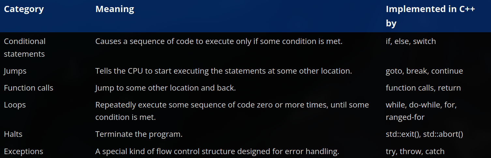

# ch8 - control flow

### 8.1 - control flow introduction 
- - -
- the *specific* sequence of statements that the CPU executes is called the program's **execution path**
- if the execution path of the program is the same in all conditions every time they are run, it is known as a **straight-line program**
- **control flow statements** are the statements which allow the programmer to change the normal path of execution through the program
- when a control flow statement causes point of execution to change to a non-sequential statement, it is called **branching**
- here are some categories of control flow statements

### 8.2 - if statements and blocks
- - - 
- a **conditional statement** is a statement that specifies whether some associated statement should be executed or not
- the two basic types of conditionals are `if` statements and `switch` statements (we will talk about `switch` later)
- note that else is optional when using an if statement 
- when you want to use multiple statements based on some condition, you use a compound statement (block)
- but for a single statement, the compiler implicitly declares a block 
- whether to put single statements in a block or not has been up for debate for a while now, although it is good practice to put it in a block for readability purposes, a reasonable middle ground is to write the single statement on the same line as the if-else statements (example: `if (age>= x) do y`)
- keep in mind that this single line method is harder to debug as it is difficult to tell whether a statement was actually executed or skipped
- use `if-else` when you want to execute the code after the first true condition, use `if-if` when you want to execute the code for all true conditions

### 8.3 - common if statement problems
- - -
- when you nest an if statement with another if statement without a block, it makes it unclear which if statement the else belongs to, this is called the **dangling else** problem
- you can flatten nested if statements by restructuring the logic or using logical operators (example: using the `&&` operator to check more than one condition at once)
- a **null statement** is a statement that just consists of a semicolon `;`, these statements do nothing, they are just used when the language requires a statement to exist but the programmer doesn't need one, it is good practice to place null statements in their own line for better readability (note that they are rarely used with if statements, most of the use cases are limited to loops)
- an example of why the null statement is placed in its own line for readability is `if (func());`, this compiles fine and is treated the same way if the semicolon was actually the condition of the if statement, but this causes a lot of confusion as to why it exists and might even mislead people to believe that the if statement ended with a semicolon
- note that if you terminate an if statement, the statements inside the if statement will execute unconditionally even when they are placed inside a block
- just like how python has the `pass` keyword to act as its null statement, cpp has a preprocessor statement that can mimic the functionality of the pass statement, it is called `PASS` and it needs to end with a semicolon so that when pass gets stripped out by the preprocessor, the trailing semicolon gets interpreted as the null statement by the compiler
- inside a condition you need to use the operator `==` to check for equality and not `=` (which is used for assignment)

### 8.4 - constexpr if statements 
- - -
- let us consider a case where the conditional is a constant expression (example: the value of `gravity: 9.8`, this is constant throughout the program, the if statement will always evaluate to true), the else statement will never be executed 
- evaluating a constexpr conditional at runtime is wasteful since the result will never vary, it is also wasteful to compile code into the executable that can never be executed
- to fix this, we have **constexpr if statements** in cpp, the conditional of a constexpr if statement is always going to be evaluated at compile time
- if the constexpr conditional evaluates to true, the entire if-else block will just be replaced by the true statement, this reduces wastage while still checking for the condition
- favour constexpr if statements over non-constexpr if statements when the conditional is a non-constant expression

### 8.5 - switch statements basics
- - -
- a **switch statement** is built for testing one expression against a set of possible values, for equality 
- it executes and evaluates the expression only once instead of repeatedly
- switch statements only work with integral values as compilers implement switch statements using **jump tables** (idk about this much yet, will learn in detail later)
- inside the switch statements, we use labels to test for the values, there are two kinds:
    1. case label - uses the `case` keyword followed by a constant expression
    2. default label - the label with the condition which runs when there is no matching value
- we use **break statements** to tell the compiler that we are done executing statements within the switch and the execution must continue after the end of the switch block
- note that inside a case statement, all the labels must be unique
- **switch vs if-else**: **switch** is better when testing one expression against a small number of exact values and only only evaluates the expression once, **if-else** is needed for comparisons other than equality

### 8.6 - switch fallthrough and scoping
- - -
- when you use a switch statement, the execution begins where the evaluated result matches a certain case label, however since it begins at a certain case label, all the other statements after it (within the switch statement) are also executed
- in other words, when execution flows from a statement underneath a label into other statements underneath the subsequent lavels it is called a **fallthrough**
- to prevent this, we use `return` or `break` control flow statements in every case label
- in cases where fallthrough is intended, you can use the attribute `[[fallthrough]]` to make it easier for other people and the compiler (since the compiler flags fallthrough as a warning) to understand that fallthrough is intended
- at this point we don't know much about attributes yet, but keep in mind that **attributes** are a modern cpp feature which allow the programmer to provide the compiler with some additional data about the codee, to specify an attribute, the name is placed between double brackets
- just like how you can combine multiple tests into a single statement using the logical operators, you can do so with the switch statements as well by placing multiple case labels in a sequence
- when you use an if statement, you need to place the statement after the if statement in a block, or the compiler will implicitly do so, but in switch statements, the case lavels are scoped as part of the switch block and not individual case labels
- you can declare/define and assign values to variables inside the case labels but you cannot intialize them
- however if you need to initalize something after a case label, you can do so by putting the case statements inside a block