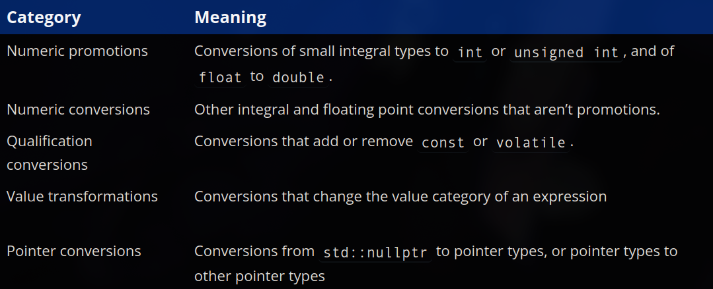
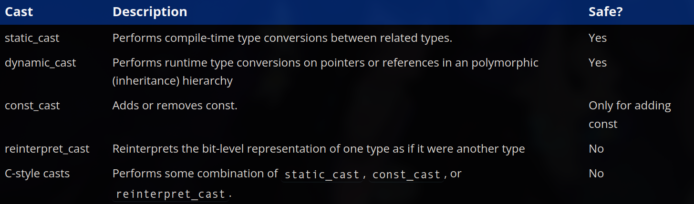

# ch10 - type conversion, type aliases and type deduction

### 10.1 - implicit type conversion 
- - -
- for a quick recap:
    1. the process of converting data from one type to another is called **type conversion**
    2. implicit type conversion is done by the compiler when one data type is required but another one is supplied
    3. explicit type conversion can be done by the programmer using a cast operator like `static_cast`
    4. type conversions do not change the data being converted instead it produces a new converted result
    5. this is done using temporary objects which can hold the result of the conversion 
- again, **implicit type conversion** is performed automatically by the compiler when an expression of some type is supplied where some other type is expected
- the vast majority of type conversions in cpp are **implicit**, for example: when initialising a variable with a value of a different data type, when the type of a return value is different from the function's declared return type or when an argument is passed to a function which is of a different type than the function parameter
- the cpp standard defines a collection of conversion rules known as the **standard conversions**, these standard conversions specify how various fundamental types convert to other types within that same group

- for example, converting an int value to a float value falls under the numeric conversions category so the compiler simply needs to apply the int to float numeric conversion rules
- note that **type conversion can fail**, when you invoke a type conversion the compiler detetmines whether it can convert tha value from the current type to the desired type, if a valid conversion cna be found then the compiler will produce the desired result, however if there is no acceptable conversion to be found, then the compilation will fail with a compile error
- in some cases, specific features may disallow some categories of type conversions (example: brace-initialisation disallows conversions that result in data loss, and converting a float value to an int value results in data loss so it is disallowed in such cases)

### 10.2 - floating-point and integral promotion
- - -
- the number of bits a data type uses is called its **width**, a wider data type uses more bits and a narrower data type uses less bits
- a **numeric promotion** is the type conversion of certain narrower numeric types (like `char`) to certain wider numeric types (like `int`) so that they can be processed efficiently (in different architectures - 32bit, 64bit etc)
- all numeric promotions are value preserving, a **value preserving** conversion (also called a safe conversion) is one where every possible source value can be converted into an equal value of the destination type
- numeric promotions are divided into two subcategories:
  1. **floating point promotions** - the floating point promotion rules allow the conversion of a type `float` to a type `double`, this means that we can write a function that takes a `double` and then call it with either a `double` or a `float`, if we call it with a `float` type, then it is automatically promoted to a `double` of equal value so it can match the function parameter
  2. **integral promotions** - the integral promotion rules allow the following conversions: signed char/short to int, unsigned char/short and char8_t to iint (if it can hold the entire range of the type), boolean to int etc.
    - this means that we can write a function taking the `int` parameter and then use it with a wide variety of other integral types
- note that not all widening conversions are numeric promotions, for example `char` to `short` or, `int` to `long` are not considered numeric promotions but rather numeric conversions, we will see why in the upcoming lessons

### 10.3 - numeric conversions
- - -
- in the previous lesson, we talked about numeric promotions which are conversions of specific narrower types to wider types so that they can be processed efficiently on different architectures
- cpp supports another category of type conversions called **numeric conversions** and these cover additional type conversions between fundamental types
- the five basic types of numeric conversions are:
  1. converting an **integral type** to any other **integral type** (`int` to `short`, `int` to `long`, `short` to `char` etc.)
  2. converting a **floating point type** to any other **floating point type** (`double` to `float`, `double` to `long double` etc.)
  3. converting a **floating point type** to any **integral type** (`double` to `int`, `float` to `int` etc.)
  4. converting an **integral type** to any **floating point type** (`int` to `double`, `int` to `float` etc.)
  5. converting an **integral type or floating point type** to a **bool** (`int` to `bool`, `double` to `bool` etc.)
- while numeric promotions are value preserving and considered safe, many numeric conversions are unsafe. an **unsafe conversion** is where at least one value of the source type cannot be converted into an equal value of the destination type
- refer to ch 10.2 on lcpp to look at the types of safe and unsafe conversions with examples

### 10.4 - narrowing conversions, list initialisation and constexpr initialisers
- - -
- in cpp, a **narrowing conversion** is a potentially unsafe numeric conversion where the destination type may not be able to hold all the values of the source type
- however narrowing conversions are not always avoidable especially when it comes to function calls where the compiler performs implicit type conversion, in such cases it is a good idea to convert the implicit narrowing conversion to an explicit narrowing conversion using `static_cast`, doing so helps document that the narrowing conversion is intentional and also suppresses compiler warnings
- brace-initialisations disallow narrowing conversions (also one of the primary reasons why this type of initialisation is preferred), doing so will cause a compilation error
- if you actually want a narrowing conversion inside a brace-initialisation you'd need to explicitly state it using `static_cast`
- note that some constexpr conversions aren't considered narrowing, because the compiler can actually evaluate the value at compile time to check if the value being converted can be stored exactly in the destination type, if it can then the values are equal and it isn't considered a narrowing conversion but if it cannot, then the compiler can halt the compilation and throw an error
- also note that conversions from a floating point type to an integral type is always considered narrowing, and a conversion from floating point to a narrower floating point is not considered narrowing even when it results in a loss of precision

### 10.5 - arithmetic conversions
- - -
- certain operators need both their operands to be the same type to actually work, if they're given different types, one or both get implicitly converted to a matching type, this is called the **usual arithmetic conversions**, and whatever type they both end up as is called the **common type**
- operators that require matching operand types: the binary arithmetic ops (`+ - * / %`), relational ops (`< > <= >= == !=`), bitwise arithmetic ops (`& ^ |`), and the conditional operator `?:` (not counting the condition itself, that one's always bool)
- compiler has a rough priority ranking of types from highest to lowest: `long double`, `double`, `float`, `long long`, `long`, `int`
- how it actually picks the common type:
  1. if one operand is an integer type and the other is a floating point type, the integer one just gets converted straight to the floating point type, no promotion step involved
  2. otherwise, any integral operands get promoted first (the usual int promotion stuff from 10.2)
  3. after that, if one's signed and one's unsigned, special rules kick in (mixing signed/unsigned is where things get messy, more below)
  4. otherwise, whichever operand has lower rank just gets converted up to match the higher ranked one
- example: `int + double` -> the int gets converted to double, result is a double. two `short`s added together -> neither is on the priority list so both get promoted to int first, result is a plain int
- **the actual dangerous part**: mixing signed and unsigned values in the same expression can give genuinely wrong-looking results, because the signed one gets silently converted to unsigned before the operation happens
- example: `5u - 10` looks like it should be `-5`, but since `10` gets converted to unsigned to match `5u`, and `-5` can't exist as an unsigned value, you get some huge wrapped-around number instead (4294967291 on a typical setup)
- another one: `-3 < 5u` prints `false`, not `true`, because `-3` gets converted to a massive unsigned number before the comparison happens, so it ends up "greater" than 5 as far as the comparison is concerned
- this is basically the biggest real reason to be wary of unsigned integers in general, mixing them with signed ones in arithmetic can quietly produce wrong results, and the compiler usually won't even warn you about it
- `std::common_type_t<type1, type2>` (from `<type_traits>`) is a way to directly ask "what would the common type of these two types actually be" without needing to work it out by hand, useful mainly for template stuff later on

### 10.6 - explicit type conversion (casting) using static_cast
- - -
- cpp comes with a number of different type casting operators that can be used by the programmer to have the compiler perform type conversion, because the casting here is explicitly requested by the programmer, this form of type conversion is called **explicit type conversion**
- cpp supports 5 different types of casts: `static_cast`, `dynamic_cast`, `const_cast`, `reinterpret_cast` and C-style casts, the first four are often referred to as **named casts**

- **c-style cast**: `(double)x`, inherited from c, works but discouraged, because it's unclear which actual kind of conversion it's secretly doing under the hood (could be doing something risky without telling you), and it's also just hard to spot/search for in code since it's just a type name in parentheses
- **static_cast**: `static_cast<double>(x)`, syntax looks like calling a function, target type goes in `< >`, value to convert goes in `( )`, returns a new temporary object of the target type
- fixes the division problem: `static_cast<double>(x) / y` converts x to a double first, forcing floating point division for the whole expression
- static_cast is better than c-style casts because it does actual compile-time checking (refuses nonsensical conversions outright) and it deliberately can't perform the riskier conversions (reinterpreting bits, dropping const), so it protects you from accidentally reaching for something dangerous
- static_cast is also useful for explicitly silencing narrowing warnings/errors when you genuinely mean to do the conversion, e.g `char ch { static_cast<char>(i) };` instead of letting the compiler complain about a possible int-to-char data loss, this doesn't make it safer, it just tells the compiler you accept the risk
- you could also write `int{x}` to convert instead of static_cast, but that still enforces the normal no-narrowing rule of list-init, meaning it can refuse to compile a conversion you actually intended, and this can even be platform-dependent (e.g `double{x}` compiles fine if int is 32-bit but fails to compile if int is 64-bit on a different machine)
- static_cast is also just easier to visually spot as "a conversion is happening here" compared to `int{x}`, which can look like a plain declaration at a glance
- `int{x}`-style temporaries also only work with single-word type names, something like `unsigned int{x}` doesn't compile due to a syntax quirk, static_cast has no such restriction
- overall: prefer static_cast over both c-style casts and over manually writing `type{x}` temporaries whenever you want an explicit conversion

### 10.7 - typedefs and type aliases
- - -
- `using` keyword creates an alias, another name for an already existing type, doesn't create a new type, just gives you a second name for one that already exists, e.g `using Distance = double;` then `Distance` can be used anywhere `double` could be used
- naming convention: capital letter, no suffix, this is the modern best practice (`_t` and `_type` suffixes exist historically and in the standard library but are inconsistent/discouraged for your own aliases), capital letter also helps tell types apart from variable/function names at a glance
- aliases are NOT distinct types, they're 100% interchangeable with whatever they alias, so two aliases pointing to the same underlying type can be mixed together without the compiler complaining, even if you meant them to represent completely different things, this makes aliases "not type safe"
- scope works exactly like variables: an alias defined inside a function only exists in that function (block scope), one defined globally is usable through the rest of the file, if you need one across multiple files, put it in a header and `#include` it wherever needed
- **typedef** is the older way to do the same thing, `typedef double Distance;` vs `using Distance = double;`, both do the same job but typedefs have annoying syntax (easy to mix up which name comes first, and gets genuinely ugly for complex types like function pointers), best practice is to just use `using` instead of typedef going forward
- 4 main reasons to actually use type aliases:
  1. **platform independence** - raw types like int/long/short don't guarantee a fixed size across machines, so aliases (combined with `#ifdef`) let you guarantee a specific size (like exactly 32 bits) regardless of what the underlying machine's int/long actually is, this is literally how fixed-width types like `std::int32_t` work under the hood
  2. **shortening long/complex types** - once types get more advanced and lengthy to type out, an alias collapses it into one short readable name, probably the single best use case
  3. **documenting meaning** - a return type like plain `int` tells you nothing about what the number actually represents, an alias like a more descriptive name at least hints at its purpose, though for just one function a comment does the job just as well, only really worth it once reused across multiple functions/variables
  4. **easier maintenance** - if you need to change a type later, you only update the alias definition in one place instead of hunting down every use of the raw type across your codebase, but changing a type can still change actual behavior, so retesting is a must, not a free lunch
- downside: every alias is one more name someone has to learn/look up, if it's not actually helping readability or maintenance, it's just extra mental overhead, especially bad when it hides a type people already know well (like `std::string`) behind an unfamiliar custom name
- rule of thumb: use aliases when they clearly help, and they pay off more the more places they get reused, not worth it for a single one-off use

### 10.8 - type deduction for objects using the auto keyword
- - -
- there's a small redundancy in something like `double d{ 5.0 };`, you're specifying `double` explicitly, but `5.0` is already a double literal on its own, so you're saying the type twice
- **type deduction** (aka type inference) lets the compiler figure out a variable's type from its initializer, done using the `auto` keyword in place of the actual type, e.g `auto d{ 5.0 };` deduces d as double since 5.0 is a double literal
- works with expressions too, not just plain literals, e.g `auto i{ 1 + 2 };` deduces int since that expression evaluates to an int, and it works with function calls too, e.g `auto sum{ add(5, 6) };` deduces whatever `add()` actually returns
- literal suffixes still work fine combined with auto, e.g `auto a{ 1.23f };` deduces float, `auto b{ 5u };` deduces unsigned int
- auto plays fine with const/constexpr too, e.g `const auto b{ 5 };` gives you a const int
- type deduction needs an actual initializer to deduce from, so `auto a;` or `auto b{};` won't compile, nothing there to infer a type from, same goes for trying to deduce from something that returns void
- **const gets dropped by default** during deduction, e.g if `a` is `const int`, then `auto b{ a };` gives you a plain `int`, not const, if you actually want the const preserved you have to add it back yourself, `const auto b{ a };`
- **string literals deduce weirdly**: `auto s{ "hello" };` deduces as `const char*`, not `std::string`, if you actually want std::string or std::string_view deduced, you need the `s` or `sv` suffix on the literal itself (`"hello"s`, `"hello"sv`), otherwise it's probably better to just skip auto here and specify the type directly
- **constexpr isn't part of the type system**, so it can't be deduced on its own, but since constexpr variables are implicitly const, that const still gets dropped the same way, and gets reapplied automatically if you write `constexpr auto` yourself
- benefits of using auto:
  1. lines up variable names nicely when declaring several in a row, easier to read at a glance
  2. forces you to always initialize the variable, since auto genuinely can't work without one, this naturally prevents accidentally leaving a variable uninitialized
  3. avoids accidental unwanted conversions, e.g assigning a function's return value into a manually specified different type can silently trigger an expensive/unwanted conversion, auto just uses whatever type the function already returns, no surprise conversion
- downsides of using auto:
  1. it hides the actual type from anyone reading the code (a good ide can still show it on hover, but it's not immediately obvious just by reading), which makes type-related mistakes easier to slip past unnoticed, e.g meaning to make something a double but accidentally initializing it with an int literal, or doing accidental integer division without realizing it since the types aren't visible in the code itself
  2. if the type of whatever you're initializing from ever changes later (a function's return type changes, another variable's type changes), the deduced type silently changes too, which can quietly ripple through your code without you noticing
- overall take: type deduction is generally considered safe and good practice for making code more readable by not cluttering it with type info everywhere, but it comes with a tradeoff of hiding details that sometimes actually matter

### 10.9 - type deduction for functions
- - -
- since the compiler already has to look at a function's return statement to check it matches the declared return type, c++14 let you skip the declared type entirely and just use `auto`, letting the compiler figure out the return type from the return statement itself, e.g `auto add(int x, int y) { return x + y; }` deduces int
- if a function has multiple return statements, they all have to deduce to the same type, or it's a compile error, e.g one branch returning an int literal and another returning a double literal won't compile, you'd have to make them consistent yourself (convert one to match, or just use an explicit return type instead)
- benefits: guarantees no accidental mismatched-type conversion since whatever the logic actually produces just becomes the return type directly, useful for return types that are "fragile" (likely to change as the implementation changes) since you don't have to manually keep updating an explicit type, and also useful when the actual return type would be genuinely awkward/complex to write out by hand
- downside 1: a forward declaration isn't enough for an auto-return function, the full definition has to be visible before you can call it, since the compiler literally can't know the return type without reading the body, this basically limits these functions to being callable only within the file they're defined in
- downside 2: it hides the return type from anyone just reading the function's signature/interface, unlike variables (where the initializer is right there on the same line), you'd have to go read the function body itself to know what it returns, general advice is to prefer explicit return types and only use auto here when the type is genuinely unimportant, fragile, or awkward to express
- **trailing return syntax** is a totally different thing that just reuses the word auto, it's not deduction at all, the real return type is still explicitly given, just moved after the parameter list using `->`, e.g `auto add(int x, int y) -> int { return x + y; }`
- useful for keeping a function's name easy to spot when the actual return type is long/complex (name would otherwise be buried at the front), and useful for visually lining up a group of function declarations so their names start at the same spot, some advanced cases (parameter-dependent return types, lambdas later on) actually require this syntax
- auto can't be used to deduce a function parameter's type, since a parameter has no actual value yet at the point it's declared, there's nothing yet to deduce from, this compiled as an error before c++20, in c++20 the same syntax became legal but it's secretly invoking a totally different feature (function templates), not type deduction