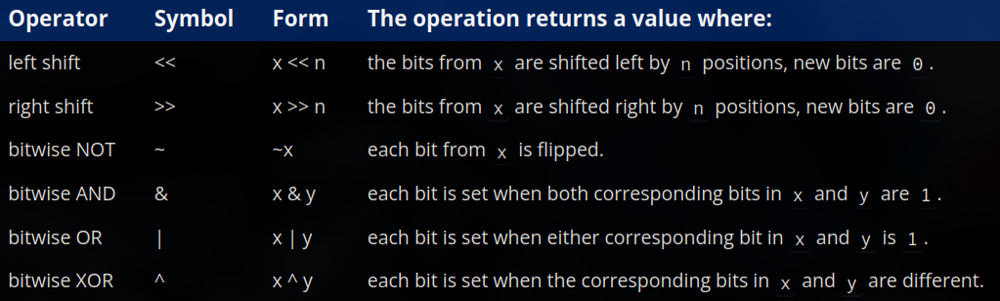
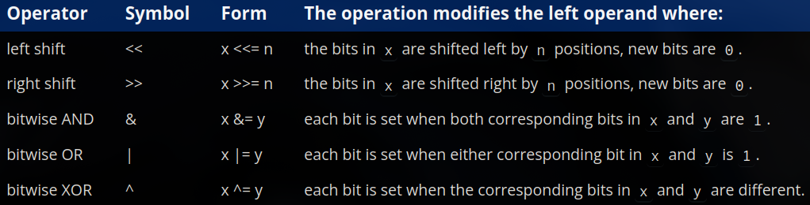

# chO - bit manipulation

### O1 - bit flags and bit manipulation via std::bitset
- - -
- modifying individual bits within an object is called **bit manipulation**
- instead of viewing objects holding a single value, we can treat each bit in that object as an independent boolean value, when individual bits of an object are used as boolean values, the bits are called **bit flags**
- a bit holding `0` is said to be false, off or not set
- a bit holding `1` is said to be true, on or set
- when a bit is changed from `0` to `1` or `1` to `0`, we say that it has been flipped or inverted
- note: in computing, a **flag** is a value that signals when some condition is true in a program, with a bit flag, the value of true means the condition exists
- in bit manipulation, it is recommended to use unsigned integers or std::bitset unambiguously 
- when given a sequence of bits, they are typically numbered from right to left, where each number denotes a **bit position**
- `std::bitset` provides useful member functions other than printing values in binary, like:
    1. `test()` - this allows us to check whether a bit is 0 or 1
    2. `set()` - this allows us to turn a bit on (does nothing if already on)
    3. `reset()` - this allows us to turn a bit off (does nothing if already off)
    4. `flip()` - this allows us to flip a bit value from 0 to 1 or 1 to 0
    5. `size()` - this returns the number of bits in the bitset
    6. `count()` - counts number of bits that are set to `true`
    7. `all()` - returns a boolean indicating whether **all** bits are set to `true`
    8. `any()` - returns a boolean indication whether **any** bits are set to `true`
    9. `none()` - returns a boolean indicating whether no bits are set to `true`
- `std::bitset` will use either 4 or 8 bytes of memory, even though it only needs 1 byte to store 8 bits, thus it is mostly used for convenience rather than memory optimization

### O2 - bitwise operators
- - -
- in cpp we have six bit manipulation operators, called **bitwise** operators, they are non-modifying operators so they do not modify their operands unless explicitly stated

- bitwise operators only defined for integral data types and `std::bitset`, it is a common practice to avoid using signed integers with bitwise operators, because manipulating the bits also affects the sign bit
- the left shift operator `<<` shifts bits to the left and the right shift operator `>>` shifts bits to the right, bits that are shifted off the end of the bit sequence are lost forever, the new bits are replaced with 0 
- when using the `<</>>` operator for both output and shifting bits, parenthesization is required to use for it for shifting
- the bitwise NOT (`~`) is quite simple, it just flips each bit from a 0 to 1 and a 1 to 0
- we've seen how the bitwise OR works already in the earlier chapter, it evaluates to true when either of the operands are true, otherwise false, the logical OR `(||)` treats the entire operand as a single value, where as bitwise OR `(|)` is applied to each pair of bits in the operands
- bitwise AND (`&`) works in a similar way like stated above, with different logic, i.e true if both paired bits are 1 and false otherwise
- bitwise XOR (`^`) is also known as exclusive or, when working with a *pair* of operands, it sets the resulting bit to true when the paired bits are **different**, however when evaluated in a compound expression, the resulting bit is true if there are are an odd number of 1 bits in that columns, 0 otherwise
- since they are non-modifying operators, we use the assignment operator along with them to modify the bits:

- a **bitwise rotation** is like a bitwise shift, but the bits shifted off one end are added to the other end instead of being lost forever

### O3 - bit manipuation with bitwise operators and bit masks
- - -
- in order to manipulate individual bits, we need a way to identify the bits we want to manipulate, a **bit mask** is a number that marks which bit positions you care about, so an operation only affects those spots and ignores everything else, the bit mask blocks the bitwise operators from touching bits we don’t want modified, and allows access to the ones we do want modified
- to check if a bit is on, we use bitwise AND (`&`) with the appropriate bit mask
- to set (turn on) a bit, we use the bitwise OR assignment (`|=`) operator with the appropriate bit mask, multiple bits can be set simultaneously this way
- to reset (turn off) a bit, we use bitwise AND and bitwise NOT together and the assignment operator (`&= ~`), with the appropriate bit masks, multiple bits can be reset simultaneously this way as well
- to flip a bit, we use bitwise XOR assignment (`^=`), with the appropriate bit mask, can also be used to flip multiple bits at once

